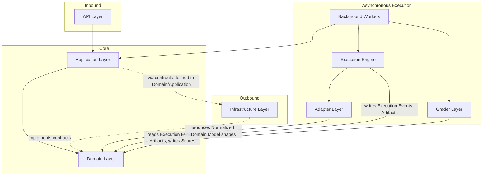
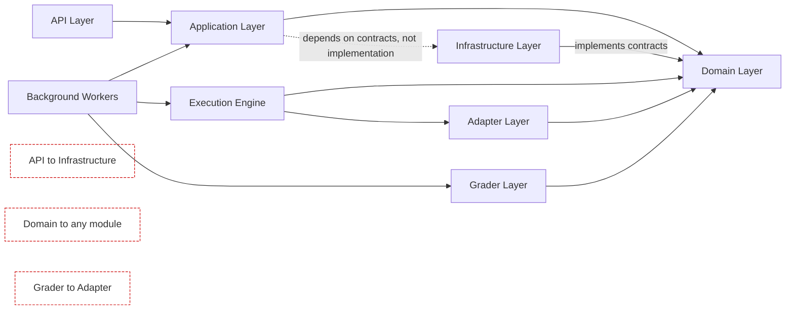
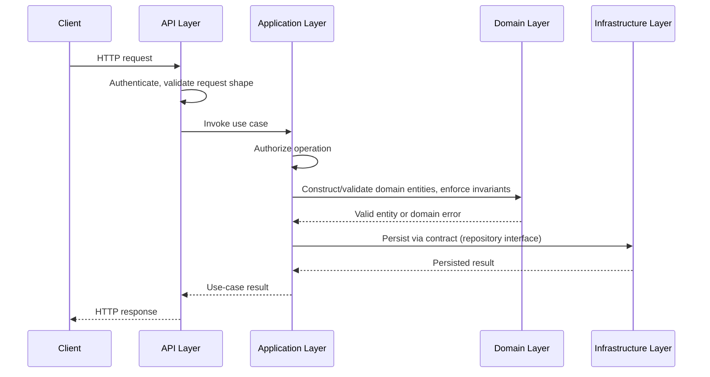

# Backend Architecture

## 1. Purpose

The backend is where EvalForge's product lives. Per ADR-0001, the backend owns the product: every piece of business logic, every validated state transition, and every authoritative read of platform data flows through it. This document defines how the backend codebase itself is organized internally — module boundaries, responsibilities, and dependency direction — so that "backend owns the product" remains true as the codebase grows, rather than decaying into a pile of code that happens to run in one process.

This document is scoped strictly to code organization. It does not define database schemas, ORM mappings, or REST endpoint contracts — those are separate documents that will project the concepts defined here onto specific technologies. It also does not redefine the business domain; every entity, invariant, and bounded context referenced below (Project, Evaluation Suite, Evaluation Case, Evaluation Run, Agent, Adapter, Grader, Score, Sandbox, Execution Engine) is exactly the concept defined in the Domain Model, used here without redefinition.

**What belongs in the backend:** all product state (via the Control Plane's data), all business rules governing what constitutes a valid Run, Suite, Case, or Score, all orchestration of the Execution and Grading planes, and the sole authority for every write to persistent state.

**What does not belong in the backend:** rendering or presentation logic (owned by the frontend, which is a pure consumer of the backend's API and SSE stream), vendor-specific agent behavior (owned by the Adapter Layer, which is part of the backend codebase but architecturally isolated within it), and infrastructure provisioning concerns like sandbox host management (the backend orchestrates *when* a Sandbox is provisioned and torn down, not the underlying compute substrate that makes provisioning possible).

## 2. Architectural Style

The backend is a **modular monolith**: a single deployable service, internally organized into modules with enforced boundaries, rather than a set of independently deployed microservices. ADR-0001 already made this decision at the system level; this section describes what it means at the code level.

**Module boundaries.** Each module in Section 3 corresponds to a distinct responsibility and, not incidentally, to one of the bounded contexts already established in the Domain Model (Evaluation Management, Execution, Agent Integration, Grading, Versioning). This is deliberate: code-level module boundaries that mirror domain-level bounded contexts mean a change to how Grading works, for instance, cannot accidentally require a change to Evaluation Management, because nothing in Evaluation Management is permitted to reach into Grading's internals.

**Internal encapsulation.** A module exposes a narrow, explicit interface — the set of application services, domain contracts, and (where relevant) events it makes available to other modules — and keeps everything else private. Other modules are not permitted to reach past that interface into a module's internal types, its persistence details, or its private helper logic. This is enforced the same way the domain model enforces entity ownership: by convention backed by code review and, where the language and tooling allow it, by import-boundary linting that fails a build if a forbidden cross-module import appears.

**Dependency direction.** Encapsulation alone is not sufficient; the *direction* in which modules and layers are allowed to depend on each other matters just as much, because uncontrolled direction is how circular coupling creeps in. Section 5 defines this precisely. The short version: dependencies flow inward, from API toward Application toward Domain, with Infrastructure depending on Domain to implement its contracts rather than the reverse.

**Why this approach was chosen.** At EvalForge's current scale, there is no team-topology or independent-release-cadence pressure that would justify the operational cost of microservices — distributed transactions, network calls in place of function calls, independent deployment coordination for a codebase small enough to reason about as a whole. What *is* valuable, immediately, is the discipline that prevents the codebase from becoming a ball of mud as it grows: clear ownership, enforced encapsulation, and a dependency graph that stays a graph rather than degrading into an undirected mess. A modular monolith gets both benefits — low operational overhead now, and a codebase whose seams are already drawn where a future service extraction would cut them — without paying for a distributed system before there is a reason to.

**Future service extraction.** Because module boundaries mirror bounded contexts and internal encapsulation is already enforced, extracting a module into an independently deployed service is a change in *where a process boundary sits*, not a redesign of *what the boundaries are*. The most likely first candidate is the Execution module (Background Workers plus the Execution Engine), since it has a distinct scaling profile — CPU/sandbox-bound, bursty — from the Control Plane's API traffic. Section 12 discusses this further.

## 3. High-Level Backend Architecture

The backend is organized into seven modules. Four of them form a layered core that handles all inbound requests and business logic (API, Application, Domain, Infrastructure); three sit alongside that core and handle the concerns unique to asynchronous, agent-integrated, multi-grader evaluation (Background Workers, Adapter Layer, Grader Layer).

| Module | Corresponds to |
|---|---|
| API Layer | The inbound REST + SSE surface described in the System Overview's Control Plane |
| Application Layer | Use-case orchestration; no plane of its own, but sits inside the Control Plane |
| Domain Layer | The Domain Model, expressed as code — technology-independent by construction |
| Infrastructure Layer | PostgreSQL, object storage, and queue integration described in the System Overview |
| Background Workers | The Execution Plane |
| Adapter Layer | Agent Integration bounded context |
| Grader Layer | The Grading Plane |



The dotted arrows denote dependency *inversion*: Application and Domain define the contracts (interfaces) that Infrastructure implements, so the arrow of actual code dependency runs from Infrastructure toward Domain even though the runtime call travels the other way. This is elaborated in Section 5.

Background Workers are the entry point for the asynchronous half of the system. A worker, on picking up a queued task, invokes the Application Layer to advance a Run's lifecycle, delegates execution orchestration to the Execution Engine (which itself invokes exactly one Adapter per Run, per the Domain Model), and afterward invokes the Grader Layer against the completed Run. Workers are the only module that depends on both the synchronous core (Application) and the asynchronous specialists (Execution Engine, Adapter Layer, Grader Layer) — that breadth of dependency is exactly why Workers is kept as thin as possible: it orchestrates, it does not contain business logic of its own.

## 4. Module Responsibilities

### Responsibility Matrix

| Module | Owns | Must NOT do |
|---|---|---|
| **API Layer** | Request/response translation, transport-level input validation, authentication verification, invoking Application services, streaming SSE progress to clients | Contain business rules; talk to Infrastructure directly; talk to the database, queue, or object storage in any form; know anything about Adapters or Graders |
| **Application Layer** | Use-case orchestration (e.g., "create a Run," "publish a new Suite Version"), transaction boundaries, coordinating multiple Domain operations into one unit of work, enforcing authorization at the operation level | Contain domain invariants itself (it delegates those to Domain); know about HTTP, SSE, or any transport concern; contain SQL, ORM calls, or any concrete Infrastructure detail |
| **Domain Layer** | Domain entities and their invariants (Project, Suite, Case, Run, Agent, Adapter identity, Grader identity, Score, Sandbox, Execution Engine as a concept), the Normalized Domain Model shape, domain events (Section 11 of the Domain Model), the contracts (interfaces) Infrastructure must implement | Depend on any other module; know about databases, queues, HTTP, or any framework; import anything from Application, API, Infrastructure, Workers, Adapter Layer, or Grader Layer |
| **Infrastructure Layer** | Concrete implementations of Domain-defined persistence and messaging contracts: PostgreSQL access, object storage access, queue publishing, external service clients | Contain business rules or decide *whether* an operation is valid — it only persists or retrieves what Application/Domain has already validated; be depended upon by Domain |
| **Background Workers** | Task consumption from the queue, invoking Application services to advance Run state, invoking the Execution Engine, invoking the Grader Layer after execution completes, translating failures into the state transitions defined by the Run lifecycle | Contain grading logic or agent-specific logic itself; talk to the API Layer; bypass Application to write directly to Infrastructure for anything that represents a business state change |
| **Adapter Layer** | Vendor-specific translation from one Agent's native interface to the Normalized Domain Model; nothing else | Persist anything itself; know about Runs, Scores, Suites, or any concept outside "translate this agent's actions into the normalized shape"; depend on any other Adapter, on Graders, or on the API/Application layers |
| **Grader Layer** | Reading a completed Run's Execution Events and Artifacts (via Domain-defined read contracts) and producing Scores | Modify a Run, an Execution Event, or an Artifact; depend on the Adapter Layer, API Layer, or Application Layer; know which Agent produced the Run it is grading |

## Internal Module Communication

Modules communicate only through:

- Application Services
- Domain Contracts
- Domain Events

Modules must never communicate by:

- importing internal implementation classes
- sharing mutable state
- reaching into another module's persistence layer

### Notes on boundary-sensitive responsibilities

**Authorization** is split deliberately: the API Layer verifies *who is making the request* (authentication), while the Application Layer enforces *whether that identity is allowed to perform this specific operation* (authorization), because the latter is a business rule (Project-scoped access, per the Domain Model's ownership model) and business rules do not belong in the API Layer.

**Validation** is likewise split: the API Layer performs shape-level validation (is this a well-formed request), while the Application and Domain layers enforce semantic validation (is this Case Version actually eligible to be run, does this Suite composition satisfy its own invariants). The API Layer's validation exists to reject malformed input cheaply, before it reaches business logic — it is not a substitute for domain validation, and domain validation is never skipped on the assumption the API Layer already checked.

**The Execution Engine**, as a domain concept, is realized in code as a component that Background Workers invoke; it is not itself a REST-reachable or database-persisted entity, matching the Domain Model's description of it as "a standing capability of the platform" rather than an instance-lifecycled entity.

## 5. Dependency Rules

The dependency graph is layered and unidirectional at its core, with one deliberate inversion.

**Allowed dependencies:**

- API Layer → Application Layer
- Application Layer → Domain Layer
- Application Layer → Infrastructure *contracts* (interfaces defined in Domain or Application, not concrete Infrastructure classes)
- Infrastructure Layer → Domain Layer (to implement the contracts Domain/Application define)
- Background Workers → Application Layer, Execution Engine, Grader Layer
- Execution Engine → Adapter Layer, Domain Layer
- Adapter Layer → Domain Layer only
- Grader Layer → Domain Layer only

**Forbidden dependencies:**

- Domain Layer → anything. The Domain Layer has zero outbound dependencies on any other backend module. It is pure, framework-free business logic, importable and testable in complete isolation.
- API Layer → Infrastructure Layer, Adapter Layer, or Grader Layer, directly. All access to persistence, agents, or grading must be mediated by Application.
- Infrastructure Layer → Application Layer or API Layer. Infrastructure implements contracts; it never calls upward into the layers that use it.
- Adapter Layer → API Layer, Application Layer, or any other Adapter. An Adapter's entire world is "translate this one Agent's output"; it has no legitimate reason to know about Runs as a persisted concept, HTTP, or a sibling Adapter for a different Agent.
- Grader Layer → Adapter Layer. This is explicitly called out because it is the dependency most tempting to add by accident — a Grader author might want to know "which Agent produced this" and reach toward the Adapter that ran it. That information, if a Grader legitimately needs it, is available as data on the Run (via the Domain Layer), never by importing or invoking the Adapter itself. Graders reason about outcomes; only Adapters and the Execution Engine reason about agent-specific mechanics.
- Background Workers → API Layer. Workers never call back into the API process; any client-visible progress update flows through the same Application-layer state transitions the API also reads from, not through a direct Worker-to-API call.



The single inversion in this graph — Application depending on Infrastructure *contracts* while Infrastructure depends on Domain to *implement* those contracts — is what keeps the Domain and Application layers free of any concrete database or messaging technology. This is the same principle the System Overview applies at the plane level (loose coupling through explicit boundaries rather than shared state), applied one level deeper, inside the Control Plane's own codebase.

## 6. Request Flow

A synchronous request (for example, fetching dashboard data or creating a new Run) follows a straight path through the layered core:

```
Client
  ↓
API Layer          (authenticate, validate shape, translate to a use-case call)
  ↓
Application Layer  (authorize, open a transaction boundary, orchestrate Domain operations)
  ↓
Domain Layer       (enforce invariants, produce/validate entities)
  ↓
Infrastructure     (persist or retrieve, via contracts Domain/Application defined)
  ↓
Response
```



Creating a Run illustrates this concretely, without leaking implementation detail: the API Layer accepts the request and authenticates the caller; the Application Layer authorizes the caller against the target Project, resolves which Suite/Case/Prompt/Agent/Adapter/Grader versions are being pinned, and asks the Domain Layer to construct a new Run entity, which enforces that a Run's identity and pinned versions are fixed at creation (per the Domain Model's Run Created event); the Application Layer then persists the new Run via Infrastructure and enqueues it for execution — enqueuing is itself a call through an Infrastructure contract, not a direct dependency on the queue technology. The response returns once the Run exists and is queued, never once it has executed, per the asynchronous execution decision in ADR-0001.

## 7. Background Execution Flow

Asynchronous evaluation execution is a separate flow from the request/response cycle above, coordinated through the queue rather than a held-open connection.

**Queue submission.** When the Application Layer creates a Run and transitions it to `Queued`, it publishes a task through an Infrastructure-provided queue contract. The Application Layer does not know or care which broker implements that contract — this is the same dependency-inversion principle from Section 5, applied to messaging instead of persistence.

**Worker execution.** A Background Worker claims the task and, through the Application Layer, transitions the Run to `Running`. It then invokes the Execution Engine, which provisions a Sandbox, checks out the Case Version's reference repository state, and hands control to the one Adapter associated with the Run's pinned Agent Version. The Adapter translates the Agent's native actions into the Normalized Domain Model shape as they occur; the Execution Engine persists each as an Execution Event (and any oversized payload as an Artifact) through Infrastructure, in strict append-only sequence, exactly as the Domain Model requires.

**Status updates.** As Execution Events are recorded, the Worker publishes live-progress updates that the API Layer's SSE endpoints stream to connected clients. This is a read-side concern layered on top of the same persisted event stream — the SSE stream does not carry its own independent source of truth; it reflects what has already been durably written.

**Grading.** Once the Agent's execution concludes (successfully, by timeout, or by failure), the Worker transitions the Run to `Grading` and invokes the Grader Layer with the completed Run's identity. Each declared Grader runs independently, reading Execution Events and Artifacts through Domain-defined read contracts, and produces a Score. A single Grader's failure is isolated — the Worker records that failure against that Grader alone and proceeds to collect results from the others, consistent with the Domain Model's Score ownership (one Score per Grader Version, never affecting another Grader's output).

**Persistence.** Every Score produced is persisted through Infrastructure via the Application Layer, the same as any other state-changing operation — the Worker does not grant the Grader Layer direct database access. Once all declared Graders have completed (or the Run's grading window closes with some Graders still pending, per the Domain Model's partial-grading treatment), the Worker transitions the Run to its terminal state (`Completed`, `Failed`, or `Cancelled`), which permanently closes it to further change.

Throughout this flow, the Worker is the only component that spans both the synchronous Application Layer and the asynchronous specialists (Execution Engine, Grader Layer) — this is why Section 4 keeps Workers deliberately thin: every actual business decision (is this transition valid, is this Score acceptable) is delegated to Application and Domain, and the Worker's own code is limited to sequencing calls to those layers correctly and handling the failure modes described in the System Overview's Failure Model.

## 8. Cross-Cutting Concerns

| Concern | Where it lives | Rationale |
|---|---|---|
| **Validation** | Shape validation in API Layer; semantic/invariant validation in Domain Layer, invoked through Application | Cheap rejection happens at the boundary; the rules that make a Run or Score valid are business rules and must live where business rules live, so they apply identically whether the caller is the API or a Worker |
| **Authorization** | Application Layer, at the use-case boundary | Authorization is a business rule ("is this actor permitted to do this, given Project scoping") and must be enforced at the same layer that enforces every other business rule, not left to the API Layer or, worse, the frontend |
| **Configuration** | A dedicated, framework-agnostic configuration surface consumed by Infrastructure and Background Workers at startup; Domain never reads configuration | Domain must remain deployable and testable without any notion of environment; configuration is exclusively an Infrastructure/Workers concern |
| **Logging** | Cross-cutting, but structured logging fields (correlation ID, run ID, worker ID — per the System Overview's Observability section) are attached at the API and Worker entry points and threaded through every call, not re-derived at each layer | A single point of origin for correlation identifiers prevents the same run's activity from being logged under inconsistent identifiers across layers |
| **Error handling** | See Section 9 | — |
| **Idempotency** | Enforced at the Application Layer for use-case invocation, and at the Infrastructure Layer for task redelivery (per the System Overview's idempotent-execution requirement) | A use case and its persistence must both be safe to invoke more than once for the same logical operation, since the queue does not guarantee exactly-once delivery |
| **Transactions** | Owned by the Application Layer, which defines the boundary of "one unit of work" for a given use case; Infrastructure executes within that boundary but does not decide where it starts or ends | Transaction boundaries are a business concept (what must succeed or fail together) before they are a database concept, and belong with the layer that understands the use case |

## 9. Error Handling Philosophy

EvalForge distinguishes errors along two independent axes: **expected vs. unexpected**, and **domain vs. infrastructure**. Where an error is handled depends on both.

**Domain errors** — an invariant violation the Domain Layer itself detects (an attempt to construct a Run against a deprecated Case Version, an attempt to score a Run that is not in a gradable state) — are expected failures from the platform's perspective, even though they represent a caller's mistake. They are raised as explicit, typed domain errors from the Domain Layer, caught and translated into a meaningful response by the Application Layer, and ultimately surfaced to the caller (API client or Worker) as a well-formed, specific failure rather than a generic exception. The Domain Layer never swallows or logs these itself — it has no logging dependency at all, per Section 5 — it simply raises them and lets the calling layer decide what to do.

**Infrastructure errors** — a database connection failure, an object storage write failure, a queue unavailable at submission — are treated as expected *categories* of failure (the System Overview's Failure Model enumerates several by name) even though any individual occurrence is unplanned. These are caught at the Infrastructure boundary, classified (transient vs. terminal), and either retried according to the policy appropriate to the operation or propagated upward as a distinct infrastructure-error type that the Application Layer can distinguish from a domain error. This distinction matters operationally: a domain error should never be retried (retrying "this Case Version is deprecated" does not make it valid), while a transient infrastructure error often should be, per ADR-0001's retry strategy for transient infrastructure failures.

**Recoverable vs. unrecoverable failures** in the execution flow follow the Domain Model's own distinction: a Sandbox provisioning failure or worker crash is an infrastructure failure, handled by the retry and lease semantics described in the System Overview, and is never conflated with a legitimate "the Agent failed to solve the Case" outcome, which is not a failure at all from the platform's perspective — it is a valid, gradable Run outcome. The Application Layer is where this distinction is made concrete: it is responsible for classifying a terminal Run state correctly (`Failed` for a platform-caused failure, `Completed` with low or zero Scores for an Agent that simply did not solve the task), because conflating the two would corrupt exactly the kind of longitudinal comparison the platform exists to provide.

**Unexpected failures** — a genuine bug, an unhandled exception anywhere in the stack — are never silently caught and suppressed at any layer. They propagate to the outermost boundary appropriate to where they occurred (API Layer for a synchronous request, Worker for an asynchronous task), are logged with full context via the correlation identifiers described in Section 8, and result in a generic, non-leaking failure response to the caller while the Run or operation involved is left in a well-defined state (never a partially-written, ambiguous one) — a guarantee that depends on the transaction-boundary discipline in Section 8 holding regardless of where in a use case the failure occurred.

## 10. Testing Strategy

Testing is organized around the same layer boundaries as the code itself, so that each kind of test verifies exactly one kind of risk.

**Unit tests** target the Domain Layer almost exclusively, since it has zero external dependencies by construction (Section 5) — every domain invariant (a Run's versions are immutable once created, a Score belongs to exactly one Grader Version, a Suite's composition change produces a new Version rather than mutating history) is verifiable in isolation, with no database, no queue, and no network involved. This is the layer where the highest density of business-rule tests should live, precisely because it is the cheapest layer to test exhaustively.

**Integration tests** target the Infrastructure Layer's implementations of Domain-defined contracts — verifying that the PostgreSQL repository implementation actually persists and retrieves entities correctly, that the object storage client actually round-trips an Artifact, that the queue client actually delivers a task. These tests are deliberately narrow: they check that an implementation honors its contract, not that the business logic using the contract is correct (that is the Domain and Application layers' job, already covered by unit tests against a fake or in-memory implementation of the same contract).

**Contract tests** verify the boundaries between modules that do not share a process at the code level even though they run in the same deployable — most importantly, the Adapter Layer's obligation to produce valid Normalized Domain Model shapes regardless of which Agent it targets, and the Grader Layer's obligation to consume that same shape correctly. A contract test for a new Adapter asserts that its output satisfies the Normalized Domain Model's shape and invariants without needing a live Agent or a live Grader — it validates that the translation boundary itself is honored, which is the entire reason the Adapter pattern exists.

**Worker tests** verify orchestration logic — that a Worker correctly sequences Application calls, correctly invokes the Execution Engine and Grader Layer, and correctly classifies failures per Section 9 — using fakes for the Execution Engine, Adapter Layer, and Grader Layer rather than exercising a real Sandbox or a real Agent. Whether a real Sandbox can actually be provisioned, or a real Agent actually produces valid output, is a separate, narrower category of end-to-end verification against the Adapter and Execution Engine directly, kept distinct from Worker orchestration tests so that a flaky sandbox environment never makes the far larger and more valuable set of orchestration tests unreliable.

Across all of these, the guiding principle is the same one that shapes the module boundaries themselves: a test should be able to fail for exactly one reason, which is only possible if the code under test has exactly one axis of responsibility — which is precisely what Sections 3 through 5 are designed to guarantee.

## 11. Package Organization

```
apps/
  api/            # API Layer: HTTP/SSE entry points, request-shape validation,
                   # authentication, translation to Application calls.
                   # Depends on: application, shared.

application/       # Application Layer: use-case orchestration, transaction
                   # boundaries, authorization enforcement, Infrastructure
                   # contract definitions where not already in domain.
                   # Depends on: domain, shared.

domain/            # Domain Layer: entities, invariants, the Normalized Domain
                   # Model, domain events, and the persistence/messaging
                   # contracts Infrastructure must implement. Organized into
                   # submodules mirroring the Domain Model's bounded contexts:
                   #   domain/evaluation_management/   (Project, Suite, Case, Prompt)
                   #   domain/execution/                (Run, Execution Engine concept,
                   #                                      Sandbox, Execution Event, Artifact)
                   #   domain/agent_integration/        (Agent, Adapter identity)
                   #   domain/grading/                  (Grader identity, Score)
                   #   domain/versioning/                (Version identity and lineage,
                   #                                      shared by every versioned entity)
                   # Depends on: nothing outside domain and shared.

infrastructure/    # Infrastructure Layer: concrete implementations of domain-
                   # and application-defined contracts — persistence, object
                   # storage, queue publishing, external clients.
                   # Depends on: domain, shared. Never depended upon by domain.

adapters/          # Adapter Layer: one submodule per supported Agent, each
                   # implementing the same translation contract into the
                   # Normalized Domain Model.
                   #   adapters/claude_code/
                   #   adapters/cursor/
                   #   adapters/gemini_cli/
                   #   adapters/codex/
                   # Depends on: domain, shared, only.

graders/           # Grader Layer: one submodule per Grader, each implementing
                   # the same read-Events-and-Artifacts, produce-Scores contract.
                   #   graders/objective/   (test pass/fail, lint, build, diff correctness)
                   #   graders/rubric/      (LLM-as-judge, criteria-driven scoring)
                   # Depends on: domain, shared, only.

workers/           # Background Workers: task consumption, orchestration of
                   # Application, the Execution Engine, and the Grader Layer.
                   # Depends on: application, domain, adapters (via the
                   # Execution Engine), graders, shared.

shared/            # Cross-cutting, framework-level concerns with no business
                   # meaning of their own: structured logging setup,
                   # correlation-ID propagation, configuration loading,
                   # common error base types. Depended upon by every other
                   # package; depends on nothing else in this tree.
```

Each package exists to make one dependency rule from Section 5 trivially checkable: if `domain/` imports nothing from `apps/`, `application/`, `infrastructure/`, `adapters/`, `graders/`, or `workers/`, the platform's core business logic is verifiably framework-independent. If `adapters/claude_code/` imports nothing from `apps/` or `graders/`, the Adapter pattern's isolation guarantee is verifiably intact. The package boundaries are not organizational convenience — they are the mechanism by which the architectural rules in this document are actually enforced in a codebase, rather than merely described in it.

No database models, ORM mappings, or endpoint definitions are specified here; those belong to the database design and API contract documents that will project this structure onto PostgreSQL and REST respectively.

## 12. Future Evolution

The module boundaries in this document are drawn specifically so that the following evolutions are additive, matching the extensibility posture already established in ADR-0001 and the Domain Model.

**Service extraction.** Because `workers/`, `adapters/`, and `graders/` already depend only on `domain/` and `shared/` — never on `apps/api/` or the concrete details of `infrastructure/` — extracting the asynchronous execution path into an independently deployed service means introducing a network boundary where an in-process call currently exists, not redesigning what calls what. The Execution module is the most likely first candidate, given its distinct, bursty scaling profile relative to the Control Plane's steady request traffic (as noted in the System Overview's Scalability Strategy).

**Plugin systems.** The Adapter Layer and Grader Layer are already structured as a fixed contract with swappable implementations — precisely the shape a plugin system needs. A future Grader SDK or Adapter SDK, as anticipated by the Domain Model's Extensibility Model, formalizes the existing internal contract into a versioned, externally documented one; it does not change the contract's shape or the modules' relationship to `domain/`.

**Additional worker pools.** Segmenting workers by resource class (lightweight vs. heavy sandboxes, per the System Overview's Scalability Strategy) is a deployment and task-routing concern within `workers/`; it does not require any change to how Workers depend on Application, the Execution Engine, or the Grader Layer.

**Multiple execution engines.** The Domain Model defines the Execution Engine by its responsibilities (orchestrate a Run, provision a Sandbox, invoke an Adapter, collect Events and Artifacts), not by a specific implementation. Should EvalForge ever need distinct execution strategies — for example, a different provisioning approach for a customer's self-hosted worker fleet, per the System Overview's enterprise self-hosted future work — multiple implementations can satisfy the same Execution Engine contract without any other module needing to know which one is active for a given Run.

The common thread, consistent with every other document in this architecture: an evolution is validated not by whether it can be built, but by whether building it means adding a new module or a new implementation of an existing contract, versus rewriting an existing boundary. Every item above satisfies the former.

## References

- System Overview (`docs/architecture/system-overview.md`)
- Domain Model (`docs/architecture/domain-model.md`)
- ADR-0001: Foundational System Architecture (`docs/adr/ADR-0001-system-architecture.md`)