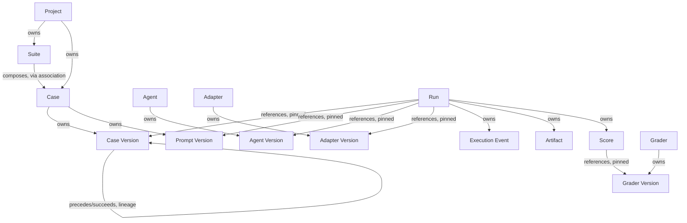

# Database Design

## Purpose

The Domain Model defines what EvalForge is — Projects, Suites, Cases, Runs, Agents, Adapters, Graders, Scores — independent of any technology. The Backend Architecture defines how the codebase that manipulates those concepts is organized — layers, modules, dependency direction. Neither document answers a question that a Staff Database Engineer must answer before a single table exists: given that PostgreSQL is the system of record, how do these concepts actually get stored, related, versioned, and kept trustworthy at the scale of millions of runs and hundreds of millions of events?

That question deserves its own document because it is a distinct kind of decision from the two documents that precede it. The Domain Model is deliberately technology-independent — it would still be true if PostgreSQL were replaced tomorrow. The Backend Architecture is deliberately storage-agnostic — its dependency rules hold regardless of which database sits behind the Infrastructure Layer's contracts. This document is neither of those things. It is the specific, opinionated projection of the domain onto a relational store, and it is allowed to make decisions — normalization boundaries, partitioning schemes, index strategy — that the domain and backend documents correctly stayed silent on because those decisions belong to a particular technology choice, not to the business itself.

This separation matters for a reason beyond tidiness. If the domain model had been written with PostgreSQL's constraints already baked in, a future migration to a different relational engine — or the introduction of a specialized store for a workload that outgrows general-purpose PostgreSQL — would require touching the definition of what a Run *is*, not just how a Run is stored. Keeping this document as a projection, rather than folding its decisions upstream, is what keeps that migration path open. When this document changes — a new partitioning scheme, a new indexing strategy, a materialized read model added for dashboard performance — nothing in the Domain Model or Backend Architecture needs to change, because nothing about what EvalForge *is* has changed. Only how it is stored has.

This document assumes the reader has already internalized the Domain Model's entities, invariants, ownership rules, and bounded contexts, and the Backend Architecture's layering and dependency rules. It does not restate either. It answers exactly one question: how should EvalForge's data be modeled and persisted in a relational database, such that the guarantees the domain promises — immutability, versioning, reproducibility — are actually upheld by the storage layer rather than merely hoped for by application code.

## Database Philosophy

**PostgreSQL as the system of record, not merely a data store.** PostgreSQL is chosen, per ADR-0001, because EvalForge's core value proposition — trustworthy longitudinal comparison across runs — depends on data that is relationally consistent by construction, not merely consistent by application discipline. A run that references a suite version that does not exist, or a score that outlives the grader run that produced it, is not a minor data-quality issue for this platform; it is a direct violation of the thing the platform exists to guarantee. A relational database with enforced foreign-key integrity is the layer that makes such violations structurally difficult rather than merely discouraged by convention, which is precisely the posture the Domain Model itself demands: invariants are not suggestions to be honored by well-behaved application code, they are guarantees the storage layer helps hold even when application code has a bug.

**Relational integrity as a second line of defense, not the first.** The Backend Architecture is explicit that domain invariants are enforced in the Domain Layer, before anything reaches persistence. The database's referential and constraint-level integrity does not replace that enforcement — it exists as a second, independent line of defense against the same class of error, catching what a bug in application logic might otherwise let through. A foreign key that cannot be violated is not there because the Application Layer is expected to fail at authorization or validation; it is there because a codebase that will be touched by many engineers over many years should not have its core guarantees depend entirely on every one of them getting every code path right, every time. This is the same philosophy the Backend Architecture applies to layering — defense through structure, not through discipline alone.

**Metadata and artifact separation.** Structured, relationally meaningful facts about a Run — its status, its pinned versions, its scores, its lineage — live in PostgreSQL. Large, write-once, rarely-relationally-queried payloads — full event transcripts, diffs, logs — do not. This split is not a performance optimization bolted on after the fact; it is a direct consequence of what each kind of data actually *is*. Metadata is data the platform reasons about relationally: it is joined, filtered, aggregated, and compared across runs. An artifact is content the platform serves as a blob to a grader or a human debugging a run; it is never joined against, and treating it as if it needed relational integrity would be modeling it as something it is not.

**Immutable historical records.** Once a Run reaches a terminal state, and once any individual fact about it — an Execution Event, an Artifact, a Score — is written, nothing about that record changes in place. This is the database-level expression of the Domain Model's central invariant, and it is treated here as a storage-layer property, not merely an application-layer promise: the schema itself is designed so that historical rows are never targets of an update statement in the platform's normal operation, only of inserts. A table designed for append-only history looks structurally different from a table designed to be mutated — different indexing priorities, different partitioning strategy, different concurrency assumptions — and every downstream section of this document reflects that distinction.

**Normalization philosophy: normalize the system of record, denormalize deliberately for read paths.** The core relational schema is normalized to the degree that a well-designed OLTP schema should be — each fact is stored once, in the table that owns it, referenced by foreign key everywhere else it is needed. This is not normalization for its own sake; it is what keeps the system of record trustworthy, since a denormalized copy of a fact is a second place that copy can silently drift from the truth. Where read performance genuinely requires it — dashboard aggregates, trend queries over large historical windows — this document treats denormalization as an explicit, named strategy (materialized or precomputed read models) layered *on top of* the normalized system of record, never as a replacement for it. The distinction matters: the normalized tables are always the source of truth; any denormalized structure is rebuildable from them and is never itself authoritative.

**Versioning as a first-class schema concern, not an afterthought.** Six independent entities — Suite, Case, Prompt, Agent, Adapter, Grader — are versioned axes in the domain, and the Backend Architecture treats versioning as its own bounded context for exactly this reason. At the storage layer, this means version identity is modeled explicitly and consistently across every versioned entity, rather than each entity inventing its own ad hoc notion of "the current one." A Run does not reference "the Case" — it references a specific, immutable Case Version, and that reference, once written, is as immutable as the Run itself.

**Append-only history as the default posture for execution data.** Execution Events, Artifacts, and Scores are modeled from the outset as insert-only tables. There is no code path, and no schema affordance, for updating a row in these tables once written. This is stricter than "the application chooses not to update these rows" — it is a structural stance that shapes indexing, partitioning, and even which constraints are worth enforcing (a constraint that would only ever be violated by an update that structurally cannot happen is not a constraint this schema needs to spend cycles checking).

**Explicit foreign-key relationships over implicit ones.** Every relationship the Domain Model describes — a Run referencing a Case Version, a Score referencing a Grader Version, a Suite composing Cases — is modeled as an explicit foreign-key relationship in the schema, never as an application-level convention (a string ID stored without a constraint, a JSON blob containing a reference the database cannot verify). The cost of this is real: explicit foreign keys constrain how data can be inserted and in what order, and they are not free at write volume. The alternative cost — silent referential drift in a system whose entire purpose is trustworthy historical comparison — is categorically worse, and this document treats that tradeoff as settled rather than open.

**The database supports business invariants; it does not replace them.** This principle disciplines every other decision in this document. A foreign key can guarantee that a Score references a Run that exists. It cannot guarantee that the Score was produced by a Grader that was actually declared applicable to that Run's Case — that is a business rule, enforced in the Domain Layer, that the database's constraint language is not expressive enough to capture on its own. Where the database can mechanically enforce an invariant, it should, because mechanical enforcement is cheaper and more reliable than reviewing application code for correctness. Where it cannot, the schema is not stretched into artificial contortions (triggers encoding business logic, exotic constraint expressions) to fake that enforcement — the invariant stays owned by the Domain Layer, and the schema's job is to make that layer's job possible, not to duplicate it.

## Storage Strategy

EvalForge's data falls cleanly into two categories with different shapes, different access patterns, and, correctly, different homes.

**Structured metadata** — Projects, Suites, Cases, Prompts, Runs, Agents, Adapters, Graders, Scores, and the version and lineage records that tie them together — is small per row, queried relationally (joined, filtered, aggregated), written at a rate driven by human and scheduling activity rather than by execution volume, and read far more often than any individual row is written. This is exactly the workload PostgreSQL is built for, and it lives there without qualification.

**Large execution artifacts** — full event payload bodies where they exceed a size threshold, complete transcripts, diffs, logs — are write-once, read as a whole rather than queried into, and can individually be large enough that storing them inline would distort the size and performance characteristics of the tables that reference them. These are stored in object storage, with PostgreSQL holding only a reference (an addressable pointer) and whatever minimal metadata (size, content type, checksum) is useful for relational queries about artifacts without needing to fetch their content.

The line between the two is not "is this data big" in isolation — it is whether the data is something the platform needs to reason about *relationally*. An Execution Event's timestamp, its run, its sequence position, and its type are metadata: the platform filters and orders by them constantly, and they belong in PostgreSQL even though the event stream as a whole is enormous in aggregate. The event's full payload — a large tool-call argument, a long stdout capture — is content the platform fetches and displays or feeds to a grader, but never filters or joins on internally; that content is the artifact, and it belongs in object storage regardless of how small any individual instance happens to be. This distinction, not raw byte size, is what determines where a given piece of execution data lives, and it is applied consistently to keep the relational tables that hold execution metadata narrow and fast regardless of how large the artifacts they reference become.

Keeping artifacts out of PostgreSQL is not solely a performance concern, though it is that too — inlining large, rarely-relationally-queried payloads would inflate table size, slow backups, and compete for buffer cache with the metadata queries that need to stay fast. It is also an operational-boundary concern: object storage scales for exactly this access pattern (write-once, large, occasionally read in full) without platform-level intervention, while PostgreSQL's scaling levers — covered in Partitioning Strategy and Scalability below — are best reserved for the metadata workload they were designed to handle.

## Aggregate-to-Database Mapping

The Domain Model's aggregate boundaries — which entities are owned completely by another, and which merely reference each other — translate directly into relational ownership, and getting this mapping right is what keeps the schema's foreign-key graph matching the domain's actual consistency boundaries rather than an accidental one.

**The Run aggregate** is the platform's largest and most tightly-owned aggregate. A Run owns its Execution Events, its Artifacts (in the sense of owning their metadata and reference, per Storage Strategy), and its Scores completely: nothing outside the Run's own lifecycle ever creates or modifies rows in these owned tables, and every row in them carries a foreign key back to exactly one Run. This is a strict parent-owns-children relationship at the relational level, matching the Domain Model's explicit statement that a Run owns these three collections completely. The Run row itself, by contrast, does not own the Case, Suite, Agent, Adapter, or Grader Versions it references — it merely points to them, because those entities have their own independent lifecycle and can be referenced by many Runs simultaneously.

**The Case aggregate** owns its own Case Versions and, through them, the Prompt Versions associated with each Case Version, since a Case's content and its prompt evolve together but are versioned on axes the domain treats as related but independently significant. A Case does not own the Runs executed against it — a Run references a Case Version, but a Case Version's row has no foreign key pointing forward into any Run, because ownership in this direction would make the Case aggregate unboundedly large and would be backwards from how the domain actually treats the relationship: Cases outlive and are referenced by many Runs, they do not contain them.

**The Suite aggregate** owns its own Suite Versions and the composition record of which Case Versions each Suite Version includes — this composition is itself relational data (a many-to-many association between Suite Version and Case Version) rather than a property embedded in either side, because a Case can belong to many Suites and a Suite's composition changing must produce a new Suite Version without in any way touching the Case rows it references. A Suite does not own the Cases it composes; it merely references them, consistent with the Domain Model's statement that a Case is not owned by any single Suite's lifecycle.

**The Agent aggregate** owns its Agent Versions. It does not own the Adapter associated with it — the Domain Model is explicit that Agent and Adapter are versioned on independent axes precisely because one can change while the other does not, which at the relational level means Agent and Adapter are separate aggregates connected by an explicit reference (which Adapter, and which Adapter Version, a given Run's Agent Version was paired with), never a single combined table that would force them to change together.

**The Grader aggregate** owns its Grader Versions. It does not own the Scores it produces — Scores belong to the Run aggregate, referencing the Grader Version that produced them, because a Score's lifecycle (created once, during a specific Run's grading phase, immutable thereafter) is governed entirely by the Run it belongs to, not by the Grader that happened to produce it. A Grader Version can be referenced by scores across many different Runs, and none of those Score rows are owned by the Grader in the aggregate sense — only referenced.

The consistent pattern across every aggregate above: ownership in the relational sense — a foreign key that implies "this row's lifecycle is bound to its parent's lifecycle" — is reserved for exactly the relationships the Domain Model describes as ownership. Every other relationship, no matter how central to the domain, is modeled as a reference: a foreign key that establishes what a row points to, without implying that the referenced row's lifecycle is in any way controlled by the referencing one. Confusing these two — modeling a reference as if it were ownership, most commonly by allowing cascading deletes across an aggregate boundary that the domain does not actually treat as one unit — is the single most consequential relational-design mistake this document is written to prevent, and it is addressed directly in Referential Integrity below.

| Aggregate | Owns (relational ownership) | References only (no ownership) |
|---|---|---|
| Run | Execution Events, Artifacts (metadata), Scores | Case Version, Suite Version, Prompt Version, Agent Version, Adapter Version, Grader Versions |
| Case | Case Versions, associated Prompt Versions | The Project it belongs to; the Suites that reference it |
| Suite | Suite Versions, Suite-composition records | The Case Versions it composes; the Project it belongs to |
| Agent | Agent Versions | The Adapter connected to it |
| Grader | Grader Versions | Nothing further — a Grader Version is referenced by Scores it does not own |

## Entity Relationships

The Domain Model's relationship graph translates into the relational schema through a small, consistent vocabulary of relationship shapes, each chosen deliberately rather than defaulted into.

**One-to-many relationships** dominate the schema and represent true ownership: one Project to many Suites and Cases, one Run to many Execution Events, one Run to many Artifacts, one Case to many Case Versions. In every one of these, the "many" side carries the foreign key back to the "one" side, and the "one" side's row is never required to know how many children it has — the count, where needed, is a query, not a stored fact, keeping the parent row stable regardless of how many children accumulate.

**Many-to-many relationships** are reserved for exactly the two places the domain genuinely describes a non-ownership, many-sided association: a Case Version can be composed into many Suite Versions, and a Suite Version composes many Case Versions (the Suite-composition association introduced in Aggregate-to-Database Mapping); and a Case declares which Graders are applicable to it, while a single Grader can be declared applicable to many different Cases. Both are modeled as their own association records rather than as an array-valued column on either side, because the association itself carries meaning worth preserving independently — in the Suite-composition case, the ordering of Cases within a Suite Version is itself part of what that Suite Version means, and an association record is what gives that ordering a stable, queryable home.

**Version references** are the relationship shape unique to this schema's versioning-aware design: wherever the Domain Model says a Run "pins" a specific version of something, the relational model is a foreign key from the Run directly to that specific version's row — never to the parent entity with an implicit "whichever version is current" resolution. This is a deliberate rejection of a pattern that would otherwise be tempting for its simplicity: resolving "current version" at read time via a join to whatever the latest version happens to be at query time would silently reinterpret history every time an entity is revised, which is precisely the failure mode Immutability Where It Matters (per the Domain Model) exists to prevent. Every version-pinning foreign key in this schema points to an immutable row that will still represent exactly what it represented at the moment the Run was created, no matter how many newer versions of that entity are created afterward.

**Ownership relationships** — the aggregate boundaries from the previous section — are enforced through foreign keys configured so that a child row cannot exist without its owning parent, and, per Referential Integrity below, cannot outlive it in any way that would corrupt the parent's completeness as a unit.

**Lineage relationships** connect a version to the version it superseded — a new Case Version references the Case Version it revises, a new Suite Version references the one it revises — forming an explicit, queryable chain per entity rather than relying on a creation timestamp to imply order. This matters because "what changed between this Case Version and the one before it" is a question the platform needs to answer cheaply and reliably (for debugging a run, or explaining a score change), and a timestamp-based ordering is a fragile substitute for an explicit predecessor reference when two versions could plausibly be created in rapid succession or via a backfill.

## Versioning Model

Versioning is the schema-level concern that distinguishes this design from a conventional CRUD-oriented relational schema, and it deserves treatment as its own subject because getting it wrong quietly undermines everything else in this document.

**Stable identity, separate from version.** Every versioned entity — Suite, Case, Prompt, Agent, Adapter, Grader — has two distinct kinds of identity in the schema: a stable identifier that names "this Suite" (or Case, or Agent) as a persistent concept across its entire history, and a separate identifier for each specific, immutable version of it. This separation is what lets "the Python Refactoring Suite" remain a single addressable concept that a user recognizes across years of revisions, while every individual version of it remains individually addressable and never mutates. Collapsing these into one identity — versioning by mutating a single row in place — is the single design choice this document rules out entirely, because it is structurally incompatible with the Domain Model's requirement that historical Runs remain interpretable after the entity they reference has since evolved.

**Immutable versions.** Once a version row is written — a specific Case Version, a specific Grader Version — it is never updated. A change to the entity always produces a new version row with a new version identifier, never a modification of an existing one. This is enforced the same way Runs are: by application-layer discipline backed by the absence of any code path that issues an update against these tables, and, where practical, by database-level protections that make an update to a finalized version row an exceptional, deliberately-resisted operation rather than a routine one.

**Lineage.** Each version references the version it supersedes (per Entity Relationships above), giving every versioned entity an explicit, traversable history rather than an implicit one inferred from timestamps. This lineage chain is itself part of the permanent record — it is never pruned, because "what did this Case look like three revisions ago, and why did it change" is exactly the kind of question the platform's audit and debugging needs answered years after the fact.

**Pinning.** A Run does not merely reference "the Case" or "the Agent" — it pins the exact version identifier of every one of the six versioned axes the Domain Model enumerates (Suite, Case, Prompt, Agent, Adapter, Grader), at the moment the Run is created, and every one of those references is to the immutable version row, never to the mutable stable-identity row with implicit latest-version resolution. This is what makes a Run "fully specified," in the Domain Model's language: given only the Run's row and the version rows it points to, every input that could have influenced its outcome is fully reconstructable, regardless of how many times any of those six entities has since been revised.

**Historical reproducibility.** The combination of immutable versions and explicit pinning is what makes a claim like "this Run was executed against exactly this Case, this Prompt, this Agent build, this Adapter mapping, and graded by exactly these Grader versions" a fact the database can prove by simple foreign-key traversal, years after the fact, rather than a fact that depends on nobody having edited anything in the meantime. This reproducibility guarantee is, in a very real sense, the schema's primary product — everything else in this document exists in service of keeping it true.

## Referential Integrity

**Foreign keys are enforced, not advisory.** Every relationship described in Entity Relationships is backed by an actual foreign-key constraint, not a convention the application is trusted to maintain. This is the direct schema-level expression of the Database Philosophy principle that the database is a second line of defense: a foreign key that the database enforces catches a bug in application code that a foreign key modeled only in a comment or a code review checklist never would.

**Deletion philosophy: preservation over removal, everywhere history matters.** EvalForge's core promise is that historical facts do not change after the fact, and deletion is the sharpest way that promise can be broken — a deleted row is not a changed fact, it is an erased one, which is strictly worse for a platform whose entire value is trustworthy historical comparison. As a result, the tables that hold historical facts — Runs, Execution Events, Artifacts (metadata), Scores, and every version row of every versioned entity — are never targets of a hard delete in the platform's normal operation. Where removal of data is genuinely required (a retention policy expiring old data, a legal request), it is handled as an explicit, deliberate, audited operation described in Retention Strategy, never as an incidental consequence of an ordinary application code path.

**Immutable references, never cascading deletes across ownership boundaries that the domain does not treat as one unit.** A foreign key from a Run to a Case Version does not cascade a deletion of the Case Version onto the Run, nor does it prevent the Case from producing new versions — the reference is immutable in the sense that it can never be redirected once written, but the tables on either end of it have entirely independent lifecycles beyond that single frozen pointer. Cascading deletes are reserved exclusively for true aggregate ownership, per Aggregate-to-Database Mapping: if a Run's row were ever removed (again, only through the deliberate process in Retention Strategy, never through ordinary operation), a cascade to its owned Execution Events, Artifacts, and Scores is correct, because those rows have no independent existence or meaning outside their owning Run. A cascade from a Case to the Runs that reference one of its versions would be a serious modeling error — it would let deleting a definitional entity silently erase execution history that the domain explicitly treats as independently significant.

**Soft deletion as the default posture for definitional entities, hard deletion as the exception for historical facts.** Definitional entities — Projects, Suites, Cases, Graders, Agents, Adapters — support a soft-deleted or deprecated state (the Domain Model already describes Case and Suite deprecation explicitly) precisely because their stable identity needs to persist even once no longer active, so that every historical version and every historical Run that referenced them remains meaningfully attributable. Historical execution facts, by contrast, are never soft-deleted in the ordinary sense — a Run does not have an "active" flag, because a completed Run's relevance to trend analysis does not diminish with time the way an "active suite you'd currently select" does. The two philosophies are not in tension; they are the correct treatment for two genuinely different kinds of row.

**Historical preservation as the tiebreaker whenever a data-modeling decision is ambiguous.** Wherever this document, or a future decision not anticipated here, faces a choice between a design that is simpler to implement and one that better preserves historical fidelity, historical preservation wins. This is stated explicitly because it will be tested repeatedly as the schema evolves — a proposed migration that would be easier to write as an in-place update of historical rows should be treated as presumptively wrong until proven otherwise, not as a convenience to be weighed neutrally against alternatives.

## Indexing Philosophy

Indexing decisions in this document are described by the query patterns they serve, not by specific index definitions — those belong to the implementation documents this specification feeds. Four distinct access patterns shape indexing priorities differently, and treating them as one undifferentiated "make queries fast" concern would under-serve at least two of them.

**Write-optimized paths.** Execution Event ingestion is the highest-volume write path in the entire platform — potentially hundreds of millions of rows accumulating over the platform's lifetime, arriving continuously while Runs are active. Indexing on this table is kept deliberately minimal: enough to support the read patterns that genuinely need it (fetching a Run's events in sequence, per Section 7 of the Backend Architecture's execution flow), and no more, because every additional index on a high-write table is additional write amplification on the path that can least afford it. This is a case where the correct indexing decision is restraint, not comprehensiveness.

**Read-optimized paths for a specific Run.** Fetching everything relevant to one Run — its events in order, its artifacts, its scores — is the single most common read pattern once a Run exists, and it is optimized directly: every owned-table foreign key back to a Run is indexed, because this access pattern (all children of one specific parent) is exactly what a foreign-key index serves best, and it is the pattern the platform's own debugging and display workflows lean on constantly.

**Historical comparison and trend-analysis queries.** Dashboard queries — pass-rate trend for a Suite across recent Runs, regression detection between run N and run N+1, cost trend across prompt revisions — are read patterns over large historical windows, filtered and grouped by dimensions like Suite, Case, Agent, and time range, not by a single Run's identity. These queries are structurally different from the "everything about one Run" pattern above, and they are the queries most likely to degrade as history grows into the hundreds of thousands or millions of Runs the Domain Model and System Overview anticipate. Composite indexes aligned to these specific filter-and-group patterns — rather than a general-purpose index on every column that might conceivably be filtered — are the right tool here, chosen and revisited as actual dashboard query patterns stabilize rather than speculatively defined in advance of real usage.

**Searching and sorting on definitional entities.** Projects, Suites, and Cases are searched and sorted by the small set of attributes users actually browse by — name, status, recency of modification — and these indexes are unremarkable in the sense that they follow standard practice for a low-write, moderate-read table; they are noted here only to distinguish them clearly from the very different indexing posture the high-volume execution tables require. Treating a Case-browsing index and an Execution-Event index as the same kind of problem is a common and costly mistake this document is written to head off.

The unifying principle across all four: an index is added because a real, named query pattern needs it, and its cost (write amplification, storage, maintenance) is weighed against that specific need — never added defensively "in case it's useful," because on the platform's highest-volume tables, a speculative index is a permanent tax paid on every future insert.

## Partitioning Strategy

**Time-based partitioning for high-write, append-only tables.** The Execution Events table — and, to a lesser but real degree, the Artifact-metadata and Score tables — grow unboundedly and are written far more often than they are read in full, exactly the profile that benefits most from partitioning. Partitioning by time (for example, by creation period) is the chosen strategy because the platform's own access patterns are naturally time-skewed: recent Runs are read and written far more actively than historical ones, and time-based partitions let the database (and operational tooling like backups and archival policies) treat recent, "hot" partitions differently from older, "cold" ones without any change to the logical schema or the queries the application issues against it.

**Why partitioning, not sharding.** Sharding distributes data across multiple independent database instances to scale writes and storage horizontally past what a single instance can handle; partitioning divides a table into physically separate segments within a single database instance, primarily to make maintenance, indexing, and pruning cheaper, without changing the fact that all the data still lives behind one relational engine with full cross-table integrity. EvalForge chooses partitioning for the same reason the System Overview explicitly rules out sharding for V1: the platform's actual bottleneck, at expected run volumes, is a specific table's write and maintenance cost, not aggregate write throughput exceeding what one well-tuned instance can sustain. Sharding would solve a problem this platform does not yet have, at the cost of losing the very thing that makes a relational system of record valuable in the first place — the ability to enforce a foreign key across arbitrary tables without a distributed-transaction protocol standing in for what a single database does natively. Partitioning delivers the operational benefit (manageable table sizes, efficient pruning of old data, faster maintenance windows) without that cost.

**Future scalability within the partitioning model.** As run volume grows, the partitioning granularity (how wide a time window each partition covers) is a tuning parameter, not a schema redesign — partitions can be made narrower as write volume grows, and older partitions can be migrated to cheaper storage tiers or eventually excluded from the platform's primary query surface entirely (see Retention Strategy) without touching the logical table definition the rest of the application depends on. This is precisely the property the System Overview points to when it notes that partitioned, append-only tables migrate cleanly to a future analytics warehouse: the partitioning boundary chosen for operational reasons today is also the natural boundary along which historical data could later be exported wholesale, should that become necessary.

## Database Transactions

**Transaction boundaries are a business concept, owned by the Application Layer, before they are a database concept.** The Backend Architecture already establishes this: the Application Layer decides what constitutes "one unit of work" for a given use case, and the database's role is to execute within the boundary the Application Layer defines, not to decide where that boundary lies. This matters for schema design because it means the schema is not designed around convenient transaction sizes — it is designed around correct aggregate boundaries (per Aggregate-to-Database Mapping), and the Application Layer's transactions are shaped to match those aggregate boundaries, not the other way around.

**Aggregate consistency is the unit transactions protect.** A transaction that creates a Run and enqueues it for execution is one unit of work because the Domain Model treats "a Run's identity and pinned versions are fixed for all time" as a single atomic fact (the Run Created domain event) — the schema does not allow a partially-created Run to exist in any observable state, and the transaction boundary is what makes that true. Similarly, a transaction that records a batch of Execution Events, or writes a Score, is scoped to exactly the aggregate it affects, never spanning multiple unrelated aggregates in a single transaction unless the business operation genuinely requires atomicity across both.

**What the database is responsible for versus what the Application Layer is responsible for.** The database guarantees that a transaction either fully commits or fully rolls back, and that constraints (foreign keys, uniqueness) are checked at commit — this is table stakes for a relational system of record. It does not decide, on its own, when a transaction should start or end, what should be included in it, or how to recover from a failed transaction at the business level (should the Run be retried, marked failed, or left for manual intervention) — those are Application Layer decisions, informed by the Error Handling Philosophy in the Backend Architecture. The schema is designed to make the Application Layer's job of drawing correct transaction boundaries easy — aggregate-aligned tables, explicit foreign keys — rather than to compensate for transaction boundaries drawn incorrectly.

## Concurrency

**Immutable writes as the primary concurrency-simplification strategy.** Most of the concurrency hazards a conventional CRUD schema has to defend against — lost updates, read-modify-write races, stale-read anomalies — arise specifically from *mutation*. Because the highest-volume tables in this schema (Execution Events, Artifacts, Scores, and every version row) are insert-only by design, the majority of the platform's write volume simply does not have these hazards to defend against. This is not an incidental benefit of the immutability decision made for domain-integrity reasons — it is one of the strongest practical arguments for that decision, because it means the schema's concurrency story for its highest-throughput tables is close to the simplest one available: concurrent inserts, coordinated only by the natural ordering the application already needs to establish (an Execution Event's sequence position within its Run).

**Append-only events under concurrent writers.** Multiple workers, and potentially multiple concurrent operations within a single Run's execution, can produce Execution Events that need to be persisted in a well-defined order. The schema's responsibility here is to make the sequence position an explicit, queryable attribute of the row rather than relying on insertion order or a timestamp with insufficient resolution to guarantee a stable ordering under concurrent writes — sequence is a fact the application assigns and the schema stores durably, not a fact the schema infers after the fact.

**Idempotent inserts for a queue that does not guarantee exactly-once delivery.** The Backend Architecture already notes that task redelivery is a normal occurrence, not an edge case, and the schema is designed accordingly: inserts that represent the outcome of a task (an Execution Event recorded, a Score produced) are structured so that reprocessing the same logical task delivery converges to the same persisted state rather than producing duplicate rows. This is achieved through uniqueness constraints scoped to the natural identity of the operation being recorded (for instance, a Score's natural uniqueness is the combination of the Run and the specific Grader Version that produced it), so that a redelivered task's insert is either a no-op against already-persisted state or is rejected cleanly by the constraint, rather than silently duplicating data that would corrupt aggregate counts or scoring.

**Locking philosophy: minimize, and prefer optimistic patterns over long-held locks.** Because the schema's write-heavy tables are insert-only, there is very little need for row-level locking to protect against concurrent mutation of those tables — there is no mutation to protect against. Where locking genuinely is needed — most notably around a Run's status transitions, which must move through the finite state machine the Domain Model defines without two workers each believing they own the same transition — the preferred pattern is optimistic concurrency (a transition that only succeeds if the row is still in the expected prior state, per the Backend Architecture's lease/ownership semantics for worker crash recovery) rather than a long-held pessimistic lock that would serialize otherwise-independent work. Long-held locks are treated as a last resort, reserved for the narrow set of operations where the business invariant genuinely cannot be expressed as a conditional, state-checked write.

## Auditability

**Immutable history is the audit trail, not a separate system layered on top of it.** Because Runs, Execution Events, Artifacts, and Scores are append-only and version-pinned by construction, the question "what happened, and what was the state of the world when it happened" is answerable directly from the system of record itself, without a parallel audit-logging subsystem attempting to reconstruct history the primary tables have already discarded. This is a direct consequence of the Database Philosophy's immutability principle, and it is worth naming explicitly as an auditability property in its own right: a schema that makes historical rows unmodifiable is, by that same property, a schema that cannot lie about its own history.

**Explicit audit records for administrative and definitional actions, distinct from execution history.** Not every fact worth auditing is an execution fact. Who created a Suite, who triggered a Run, who modified a Case's content — these are administrative actions the System Overview's Observability section already identifies as requiring their own audit trail, distinct from execution events and retained independently of run-data lifecycle policies. This schema models that distinction explicitly: administrative audit records are their own table (or family of tables), separate from Execution Events, because conflating "what the platform's execution did" with "what a human or automated caller directed the platform to do" would blur two different kinds of accountability that the platform needs to answer independently.

**Historical lineage as an auditability feature, not only a versioning convenience.** The lineage chains described in Versioning Model — each version referencing its predecessor — serve auditability directly: "why did this Run's score differ from a similar Run six months ago" is answered, in part, by walking the lineage of every versioned entity the two Runs pinned and identifying exactly which one changed and when. Without explicit lineage, this question degenerates into manual archaeology across timestamps and inference; with it, the answer is a bounded, mechanical traversal.

**Why trust matters here specifically.** EvalForge's output — regression detection, trend charts, agent comparisons — is data other teams use to make real decisions about which agent to adopt or which prompt revision to ship. If the underlying data can be shown to have been silently altered, or if its provenance cannot be reconstructed with confidence, every decision built on that data is undermined retroactively, not just going forward. Auditability, in this schema, is therefore treated as load-bearing for the platform's core value proposition, not as a compliance checkbox — every design decision in this document that favors preservation over convenience (soft deletion over hard deletion, immutable versions over in-place edits, explicit lineage over inferred ordering) ultimately exists in service of this one property.

## Retention Strategy

**Metadata retention: default to indefinite, informed by the platform's own value proposition.** Structured metadata — Run records, Scores, version lineage — is retained indefinitely by default, because the platform's central promise is trend and regression analysis over arbitrarily long historical windows, and truncating that history undermines the promise directly. Where retention limits are eventually introduced, they are treated as an explicit, configurable policy applied deliberately (for example, at the Project level, or scoped to specific low-value data categories), never as an implicit consequence of a table growing inconveniently large — table size is a partitioning and scalability problem, addressed in those sections, and is never allowed to quietly become a de facto retention policy through neglect.

**Artifact retention: independently tunable, because artifacts and metadata have different cost profiles.** Large artifacts — full transcripts, diffs, logs — are more expensive to retain indefinitely than the metadata that references them, and because they already live in object storage rather than PostgreSQL (per Storage Strategy), their retention policy is independently tunable without touching the relational schema at all: an artifact can be moved to cheaper cold storage, or eventually expired, while the metadata row that references it (and records that it existed, its size, its checksum) remains in PostgreSQL permanently. This means a Run's relational record — that it happened, what it scored, what it was run against — can remain a complete historical fact even in a future where the raw artifact content behind it has been archived out of immediate reach, which is a deliberate design choice: the facts the platform's trend analysis depends on must never be at the mercy of an artifact retention policy tuned primarily for storage cost.

**Historical Runs are never pruned as a routine operation.** Consistent with Referential Integrity's deletion philosophy, a Run's metadata is not a candidate for routine deletion once its retention window (if any is ever configured) has not yet expired — and even where a retention window does eventually apply, expiring a Run is treated as a deliberate, auditable operation in its own right (recorded, per Auditability, as an administrative action), never as a silent background cleanup job whose behavior is invisible to the platform's own audit trail.

**Cleanup philosophy: reversible and observable before irreversible.** Wherever retention policy calls for removing data, the schema and the processes built on it favor staged, observable removal — moving artifacts to a colder, cheaper tier before considering outright deletion, marking metadata as scheduled-for-removal before it is actually removed — over an immediate, irreversible delete. This staging exists specifically because the cost of retaining data too long is almost always recoverable (storage cost, addressed by tiering), while the cost of deleting data that should have been kept is not.

**Long-term reproducibility as the retention strategy's north star.** Every retention decision in this document is evaluated against a single question: does this preserve the platform's ability to answer "what happened in this Run, and why did it score the way it did" for as long as the metadata for that Run exists? Artifact tiering answers yes, because the metadata and the fact of the artifact's existence persist even if the artifact's content is archived. Deleting a Run's metadata answers no, which is exactly why that action, wherever it is eventually permitted at all, is treated as the most deliberate and exceptional operation this schema supports.

## Scalability

**Expected growth, taken seriously without being prematurely optimized against.** EvalForge is expected to accumulate millions of Evaluation Runs and, correspondingly, hundreds of millions of Execution Events over its lifetime, per the scale the System Overview and Domain Model anticipate. This document takes that growth seriously in its structural decisions — versioning, append-only history, time-based partitioning of the highest-volume tables — while deliberately not reaching for scalability mechanisms the platform's actual V1 load profile does not yet justify, matching the System Overview's own stated posture on this exact question.

**Partitioning as the first and primary lever.** As established in Partitioning Strategy, time-based partitioning of Execution Events (and related high-write tables) is the mechanism that keeps the highest-volume table manageable as it grows into the hundreds of millions of rows — bounding the size of any single partition, keeping maintenance operations (vacuuming, reindexing) tractable, and enabling old partitions to be pruned from the platform's primary query surface without a disruptive migration.

**Read replicas for dashboard and analytics query traffic.** As dashboard and trend-analysis query volume grows to a point where it begins competing with the write traffic from active Run execution — a distinct concern from table size, addressed by partitioning — read replicas are the next lever, separating the query patterns described in Indexing Philosophy's "historical comparison" category onto infrastructure that cannot contend with the write path Execution Events depend on. This is a deployment-topology decision building on top of the schema described in this document, not a schema change in itself: the same tables and relationships serve both the primary and its replicas.

**A future analytics warehouse, anticipated but not built prematurely.** The System Overview already identifies a dedicated analytics warehouse as explicitly out of scope for V1, and this document's schema is designed so that decision remains available without cost paid now: partitioned, append-only tables are precisely the shape that migrates cleanly into a warehouse's ingestion model when that need eventually arises, because the data is already organized by the same time-based boundaries a warehouse's own partitioning would use. Building the warehouse now, before there is a real analytics workload that PostgreSQL with read replicas cannot serve, would be optimizing against a load profile the platform does not have data on yet — exactly the mistake the System Overview's Scalability Strategy warns against, applied here to the database layer specifically.

**What this document explicitly does not do in the name of scalability.** No sharding, no multi-region replication, and no premature introduction of a specialized analytics store are part of this design. Each would solve a problem this platform's expected V1 and near-term growth does not present, at real ongoing operational cost, and each remains a viable future evolution — addressed directly in Future Evolution below — precisely because nothing in this document's structural decisions forecloses it.

## Non-Goals

This document defines architecture, not implementation, and the following are explicitly out of scope, belonging instead to the documents that will project this design onto a concrete technology stack.

**ORM modeling.** How these tables and relationships are expressed as SQLAlchemy models — class hierarchies, mapped attributes, relationship loading strategies — is an implementation decision made against this document, not part of it.

**Migration tooling and history.** How schema changes are sequenced and applied over time via Alembic (or any migration tool) is a deployment and tooling concern, not an architectural one; this document describes the target shape of the schema and the principles governing its evolution, not the mechanics of getting from one version of it to the next.

**Actual SQL.** No table definitions, column types, constraint syntax, or query text appear in this document by design, and none should be inferred from it as authoritative — they are the output of applying this document's principles, not a substitute for that work.

**Repository implementation.** How the Backend Architecture's Infrastructure Layer concretely implements the persistence contracts the Domain and Application layers define — connection handling, query construction, result mapping — is Infrastructure Layer implementation detail, governed by the Backend Architecture's dependency rules but not specified here.

**Query optimization at the level of specific execution plans.** This document establishes indexing *philosophy* — which query patterns matter and why — but not specific index definitions, query hints, or execution-plan-level tuning, which are necessarily derived from real query behavior against real data volumes rather than architected in advance of either.

**API and endpoint design.** How any of this schema's data is exposed over REST, what request or response shapes look like, and how pagination, filtering, or sorting are surfaced to API clients belong entirely to the API design documentation, governed by the Backend Architecture's API Layer but untouched by this document.

## Future Evolution

**Multi-region deployment.** The System Overview already excludes multi-region deployment from V1 scope, and nothing in this schema forecloses it later: a stateless worker fleet and a partitioned, append-only event history (per Partitioning Strategy) are both structurally compatible with a future multi-region topology, whether that eventually means read replicas in additional regions or, further out, a more involved multi-primary strategy — neither requires revisiting the core relational model described here, only the deployment topology surrounding it.

**A dedicated analytics warehouse.** As discussed in Scalability, the same partitioning boundaries chosen for operational reasons in PostgreSQL are the natural seams along which historical data would be exported into a warehouse, should analytics query volume eventually outgrow what read replicas can comfortably serve. This is anticipated explicitly, and the schema's time-based partitioning is chosen with half an eye toward that future migration path, without building any part of the warehouse itself prematurely.

**Cold storage for aged artifacts and, eventually, aged partitions.** Retention Strategy already establishes tiering for artifacts independently of their metadata; the same principle extends naturally to metadata partitions themselves once they age past the window of active dashboard relevance — an old Execution Events partition can eventually move to cheaper storage or be excluded from the primary query surface while its existence and the facts it recorded remain reconstructable, consistent with this document's retention philosophy.

**Tenant partitioning, should multi-tenancy arrive.** The Backend Architecture and Domain Model both note that Project-scoped authorization was chosen specifically so that an organization or tenancy layer above it is additive. At the database layer, this means tenant isolation, if it arrives, is most naturally expressed as a partitioning or row-level-security dimension layered on top of the existing Project-scoped schema — every table already relates back to a Project, directly or transitively, which is precisely the seam a tenant boundary would need. This document does not design that layer now, because V1 assumes a single organization, but it notes the seam exists and is not accidental.

**The core relational model as the stable center of all of the above.** Every evolution described in this section is, deliberately, an addition around the schema's edges — a new deployment topology, a new downstream consumer of the same partitioned history, a new storage tier for aging data, a new isolation dimension layered on existing scoping — rather than a change to the aggregate boundaries, versioning model, or referential-integrity rules established in the sections above. That stability is the actual measure of whether this document succeeded: a database design specification is only as good as its ability to absorb five years of the platform's real growth without needing to be rewritten, and every principle in this document was chosen with that test in mind.

## References

- System Overview (`docs/architecture/system-overview.md`)
- Domain Model (`docs/architecture/domain-model.md`)
- ADR-0001: Foundational System Architecture (`docs/adr/ADR-0001-system-architecture.md`)
- Backend Architecture (`docs/architecture/backend-architecture.md`)