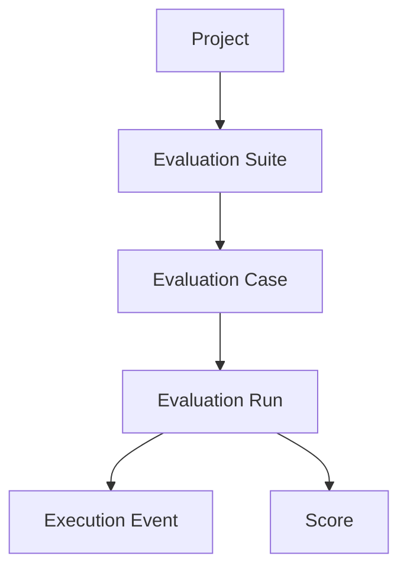
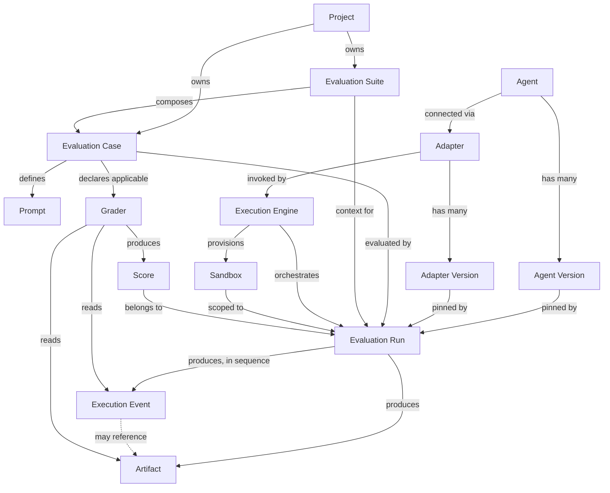
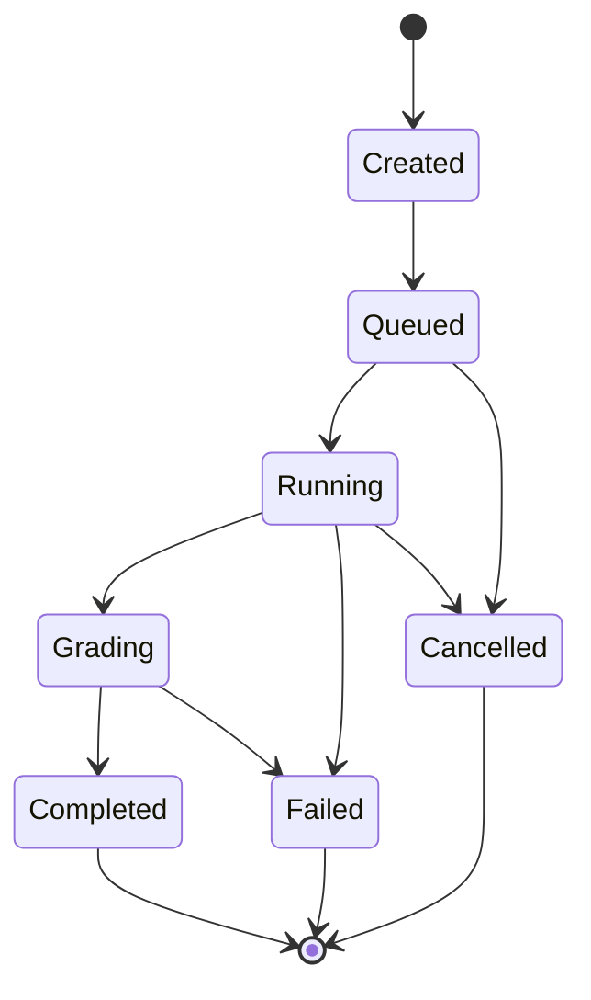
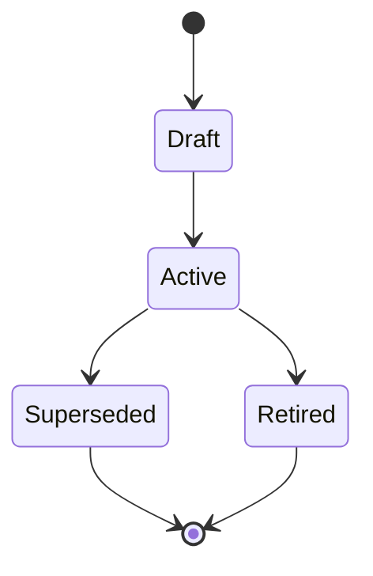
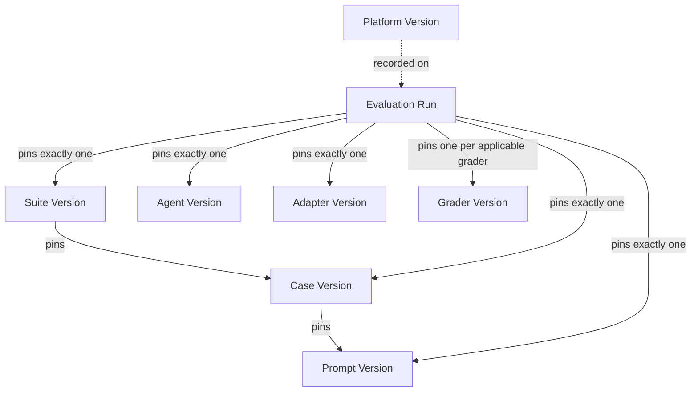

# EvalForge Domain Model

## 1. Purpose

The System Architecture document answers "how is EvalForge built." This document answers a different question: "what is EvalForge, independent of how it is built." That distinction is not academic. The System Architecture describes four planes, a FastAPI backend, Celery workers, Redis, PostgreSQL, and S3-compatible object storage — real choices, correctly justified, and subject to change as the platform scales. The domain model describes Projects, Evaluation Suites, Evaluation Cases, Runs, Graders, and Scores — concepts that would still be true if the backend were rewritten in Go, the queue replaced with a different broker, or the relational store replaced with something else entirely.

A domain model exists to give the business concepts a permanent, technology-independent home. Every other document in this repository — schema design, API contracts, worker implementation, grading pipeline internals, adapter specifications, frontend state — is a *projection* of the concepts defined here onto a particular technology. When those projections inevitably change (a new database, a new queue, a new frontend framework), this document should not need to change. When the business changes (a new kind of evaluation case, a new way of scoring, a new versioning axis), this document should change first, and every downstream document should follow it.

Separating the domain from implementation also does something more immediate: it gives every engineer working on EvalForge — backend, worker, grading, adapter, or frontend — the same vocabulary. The System Architecture's Terminology table (§2) is the seed of that vocabulary. This document is its full elaboration: not just what each term means, but who owns each concept, what its lifecycle looks like, what must always be true about it, and how it relates to everything else.

One clarification on naming: the System Architecture uses the phrase **Normalized Domain Model** (§7) for a specific, narrower thing — the internal, agent-agnostic representation of tool calls, edits, and outputs that adapters produce and that the execution engine and graders consume. That is a technical schema concept, scoped to the shape of a single agent action. The **domain model** described in *this* document is the broader business model: the full set of concepts (Project, Suite, Case, Run, Grader, Score, and so on) that make EvalForge a coherent product. The Normalized Domain Model is one specific building block inside this larger model — it is the shape that the content of an Execution Event takes. The two terms describe related but different things, and this document uses "domain model" only in the broader sense from here forward.

## 2. Domain Philosophy

**Ubiquitous language.** Every term in this document is drawn from, and consistent with, the canonical Terminology table in the System Architecture. Engineers, product stakeholders, and documentation should never need a second vocabulary for the same concept — a Score means the same thing in a design review, a database column comment, and a support conversation. Where this document introduces a term the System Architecture does not (for example, "Case Version" as a distinct concept from "Evaluation Case"), it does so as an elaboration of an idea the System Architecture already assumes, never as a contradiction of it.

**Explicit ownership.** Every entity in EvalForge has exactly one concept responsible for its correctness and exactly one concept responsible for creating it. Ambiguous ownership is how domain models rot — two components each assuming the other validates an invariant, and neither doing so. Section 6 makes this explicit for every entity.

**Immutability where it matters.** EvalForge's core value proposition is trustworthy longitudinal comparison: which agent regressed, which prompt revision helped, how a suite's pass rate trended over time. That value proposition is only as strong as the guarantee that historical facts do not change after the fact. Runs, Execution Events, Artifacts, and Scores are immutable once written, for exactly this reason. Definitional entities — Suites, Cases, Prompts, Graders — are allowed to evolve, but they evolve by producing new, independently addressable **Versions** rather than by mutating history out from under runs that already referenced the old version. Immutability is applied surgically, not universally: it protects facts about the past, not the platform's ability to improve going forward.

**Aggregate boundaries.** Not every entity that references another belongs inside the same transactional and conceptual boundary as it. A Suite references Cases, but a Suite does not own a Case's lifecycle — many Suites can reference the same Case, and a Case can outlive any individual Suite that references it. A Run owns its Execution Events, Artifacts, and Scores completely — nothing outside a Run's own lifecycle ever creates or mutates them. Section 5 draws these boundaries explicitly, because they determine what "one unit of change" means for each part of the domain.

**Loose coupling, expressed in the domain.** The System Architecture's planes communicate through REST, a queue, and an event stream rather than shared process state, so that any plane can change independently. The domain model expresses the same principle differently: entities relate to each other through explicit references (a Run references a Case Version; it does not embed a copy of the Case) rather than through shared mutable structure. This is what makes it possible for a Case to be edited without silently altering the meaning of every Run that already ran against it.

**Extensibility as a first-class design goal.** A platform whose entire purpose is evaluating a growing, unpredictable set of coding agents against a growing, unpredictable set of task types cannot afford a domain model that requires redesign every time a new agent, grader, or case category appears. Agent, Adapter, Evaluation Case, Grader, and Artifact are all deliberately modeled as open, extensible categories rather than closed enumerations. Section 10 details exactly how each remains open without weakening any invariant.

## 3. Core Domain Model

### Project

**Responsibility.** A Project is the top-level scoping boundary for everything else in the domain: every Evaluation Suite, every Evaluation Case, and every Evaluation Run exists within exactly one Project. It is the unit of authorization — the boundary that determines who may view or trigger evaluation activity for a given body of work.

**Ownership.** A Project is created by whichever actor is establishing a new scope of evaluation work (a team standing up evaluation for its own codebase or product line). Once created, its membership and settings are modified by actors who have been granted administrative rights within it.

**Lifecycle.** A Project is long-lived and rarely deleted. It accumulates Suites and Cases over time and is essentially never "completed" the way a Run is.

**Relationships.** A Project owns many Evaluation Suites and many Evaluation Cases directly. A Suite composes Cases that belong to the same Project — cases are not shared across Project boundaries, which is what makes Project a meaningful authorization boundary rather than a purely cosmetic label.

### Evaluation Suite

**Responsibility.** An Evaluation Suite is a named, versioned collection of Evaluation Cases that are executed together as a single comparable unit — for example, "Python Refactoring Suite" or "Multi-File Bug Fix Suite." A Suite's job is to define *which* Cases, at *which* Case Versions, constitute one coherent evaluation workload.

**Ownership.** Created by a Project member curating an evaluation workload. Modified by adding, removing, or reordering the Cases it composes — each such modification produces a new Suite Version rather than altering history.

**Lifecycle.** A Suite is drafted, published for use, and may later be superseded by a new version as its composition changes. Old Suite Versions remain permanently addressable because historical Runs reference them.

**Relationships.** Belongs to exactly one Project. Composes many Evaluation Cases (a case may belong to more than one Suite). Is the entity a user selects when initiating a batch of Runs.

### Evaluation Case

**Responsibility.** An Evaluation Case is a generic, extensible representation of a single engineering task — a bug fix, feature request, refactor, or security patch — that an agent attempts to solve. It is the atomic unit of evaluatable work: everything about what the agent is being asked to do, and how success will be checked, is anchored to a Case.

**Ownership.** Created by a Project member authoring a new task. Modified by editing the task description, the reference repository state, or the expected checks — each such edit produces a new Case Version.

**Lifecycle.** Drafted, published for use in Suites, and eventually deprecated in favor of a revised version once a flaw or ambiguity is discovered. A deprecated Case Version is never deleted; it remains the permanent record of what a historical Run was actually evaluated against.

**Relationships.** Belongs to exactly one Project. Referenced by zero or more Evaluation Suites. Defines exactly one Prompt (per Case Version) and declares which Graders apply to it. Is the entity a Run is executed against.

### Prompt

**Responsibility.** A Prompt is the instruction content — task framing, constraints, system-level guidance — actually handed to the agent for a given Case. It is modeled separately from the rest of the Case's content because prompt wording is tuned and experimented with independently of the underlying task definition (the reference repository, the expected checks) and needs to be versioned on its own axis for exactly that reason.

**Ownership.** Created alongside a Case by the same author. Modified by whoever is iterating on how the task is framed to the agent — each wording change produces a new Prompt Version, independent of whether the Case itself changed.

**Lifecycle.** Drafted, made active, and superseded by later revisions as prompt wording is refined based on observed agent behavior.

**Relationships.** Belongs to exactly one Case. A Run pins one specific Prompt Version, recorded independently of the Case Version it was paired with, so that prompt regressions can be measured while holding the Case constant.

### Evaluation Run

**Responsibility.** An Evaluation Run is a single, immutable execution of one Agent Version against one Evaluation Case Version, producing an ordered stream of Execution Events and a set of Scores. The Run is the central unit of evaluation in the entire domain — nearly every other entity exists either to configure a Run, to be produced by one, or to describe one.

**Ownership.** Created by a Project member (or an automated caller acting with that member's authorization) initiating an evaluation. Once created, a Run is never edited by any actor — it advances through its own lifecycle via append-only additions (events, artifacts, a status transition, scores), never through modification of anything already written.

**Lifecycle.** See Section 7. A Run moves through a small, finite set of states from creation to a terminal outcome, and once terminal, it is permanently closed to further change.

**Relationships.** References exactly one Evaluation Case Version, one Prompt Version, one Agent Version, one Adapter Version, one Suite Version (when run as part of a suite), and the set of Grader Versions that graded it. Produces many Execution Events, many Artifacts, and one Score per applicable Grader. Executes within exactly one Sandbox, orchestrated by the Execution Engine. Also carries the execution-cost facts (token usage, wall-clock time, compute consumed) that make cost a first-class, per-run metric alongside correctness.

### Execution Event

**Responsibility.** An Execution Event is a discrete, timestamped record of something that happened during a Run — a tool call, a file edit, a shell command, or a piece of output. The ordered sequence of Execution Events for a Run *is* the run's execution history: "why did this evaluation fail" is answered by reading this sequence, not by attempting to reproduce a possibly non-deterministic agent behavior.

**Ownership.** Created exclusively by the Execution Engine (via the Adapter translating agent-native actions into this normalized shape) while a Run is active. No other concept ever creates or edits an Execution Event.

**Lifecycle.** Append-only. An Execution Event is written once, in strict sequence relative to the other events of its Run, and never altered or removed afterward.

**Relationships.** Belongs to exactly one Evaluation Run. May reference one or more Artifacts (for events whose full payload is too large to carry inline — a large diff, a long stdout capture). Consumed by Graders as the raw material for scoring.

### Artifact

**Responsibility.** An Artifact is a large, immutable payload associated with a Run — a diff, a log, a full transcript — that is conceptually part of the Run's record but is too large or too rarely queried structurally to live alongside the Run's core metadata. An Artifact is content, not metadata: its role in the domain is to be the thing Graders read and the thing a human inspects when debugging a Run.

**Ownership.** Created by the Execution Engine during a Run, or by the Grading process when a grader itself produces a durable output (for example, a rendered rubric explanation). Never modified after creation.

**Lifecycle.** Written once, retained for the useful life of the Run it belongs to, and never edited. Deletion, where it happens at all, is a retention decision made about the whole Run, not an edit to the Artifact itself.

**Relationships.** Belongs to exactly one Evaluation Run. May be referenced by one or more Execution Events. Consumed by Graders.

### Agent

**Responsibility.** An Agent represents a coding agent product under evaluation — Claude Code, Cursor, Gemini CLI, Codex, or any future entrant. It is the stable identity of "the subject under test," distinct from any particular release of that subject.

**Ownership.** Created by whoever registers a new coding agent as a supported evaluation subject. Its Agent Versions are created as the vendor ships new releases or builds that the platform chooses to track.

**Lifecycle.** Long-lived, effectively for as long as the vendor's product exists and EvalForge continues to support it.

**Relationships.** Has many Agent Versions. A Run pins exactly one Agent Version. Is connected to the platform through exactly one Adapter (which itself has its own, independently tracked versions).

### Adapter

**Responsibility.** An Adapter is the vendor-specific translation layer between one Agent's native interface — its CLI invocation surface, its tool-call format, its output structure — and EvalForge's normalized representation of tool calls, edits, and outputs. It is the *only* concept in the domain permitted to know anything agent-specific. Its existence is what allows the Execution Engine, the event schema, and every Grader to be written once and never branch on which agent produced a Run.

**Ownership.** Created and modified by whoever implements support for a given Agent's interface. An Adapter's modification is independent of the Agent it targets — the underlying agent can be unchanged while the adapter's mapping logic changes (or vice versa), which is exactly why Adapter and Agent are versioned on separate axes.

**Lifecycle.** Created when an Agent is first onboarded; revised whenever the vendor changes their agent's output format or invocation surface, or whenever EvalForge's normalized representation itself evolves.

**Relationships.** Associated with exactly one Agent. Invoked by the Execution Engine for every Run against that Agent. Never persists business state itself — it is a pure translation boundary, not a store of record.

### Grader

**Responsibility.** A Grader is an independently invokable unit that consumes a completed Run's Execution Events and Artifacts and produces one or more Scores. Graders fall into two families — objective (test pass/fail, lint, build success, diff correctness) and rubric-based (structured, criteria-driven judgment) — and both are modeled identically in the domain: something that reads a Run's record and emits a Score. A Grader never modifies the Run it grades.

**Ownership.** Created and modified by whoever authors a new grading capability. Independently deployable and independently executable — one Grader's failure or change is isolated from every other Grader evaluating the same Run.

**Lifecycle.** Drafted, made active, and superseded by later versions as rubric wording, scoring thresholds, or objective-check logic changes. A Case declares which Graders (and, transitively, which Grader Versions at the time a Run executes) apply to it.

**Relationships.** Declared as applicable by one or more Evaluation Cases. Produces many Scores, one per Run it grades (per Grader Version). Consumes a Run's Execution Events and Artifacts read-only.

### Score

**Responsibility.** A Score is a single graded output value — objective or rubric-based — attached to a Run. It is the domain's answer to "how did this Run do," decomposed into as many independent measurements as there are applicable Graders.

**Ownership.** Created exclusively by a Grader, at a specific Grader Version, during the grading phase of a Run's lifecycle. Never created or modified by anything else, including the Run itself.

**Lifecycle.** Written once, atomically, when its producing Grader completes. Immutable thereafter.

**Relationships.** Belongs to exactly one Evaluation Run. Produced by exactly one Grader and exactly one Grader Version — this pairing is what makes it possible to tell whether an apparent score regression reflects a real change in agent behavior or simply a change in how the grader scores.

### Sandbox

**Responsibility.** A Sandbox is the isolated, ephemeral execution environment in which an Agent operates during a single Run — its own filesystem, its own process space, and restricted network egress limited to what the Case explicitly requires. It is the domain's expression of the platform's most important security boundary: EvalForge, by definition, runs untrusted, autonomously generated code and shell commands on every single Run.

**Ownership.** Provisioned by the Execution Engine at the start of a Run and torn down by the Execution Engine at the end of one. No other concept creates, shares, or persists a Sandbox.

**Lifecycle.** Provisioned fresh, used for the duration of exactly one Run, and destroyed. A Sandbox is never reused across Runs and never retains state between them.

**Relationships.** Belongs to exactly one Evaluation Run. Hosts the Adapter's invocation of the Agent. Everything the Sandbox observes is translated into Execution Events and Artifacts before it leaves the Sandbox boundary.

### Execution Engine

**Responsibility.** The Execution Engine is the domain concept responsible for orchestrating a Run's execution end to end: provisioning the Sandbox, checking out the Case's reference repository state at the correct Case Version, handing control to the appropriate Adapter, and collecting the resulting Execution Events and Artifacts. It is deliberately agent-agnostic — it never depends on vendor-specific logic, which is precisely why a new Agent can be supported by writing a new Adapter alone.

**Ownership.** A platform-level responsibility rather than an entity that is created or edited by any actor; it is invoked once per Run and its behavior itself is versioned (as "Platform Version," see Section 9) so that engine-caused behavior changes can be distinguished from agent- or grader-caused ones.

**Lifecycle.** Not instance-lifecycled the way a Run or Case is — it is a standing capability of the platform, invoked anew for every Run.

**Relationships.** Orchestrates exactly one Run at a time per invocation. Provisions one Sandbox per Run. Invokes exactly one Adapter per Run. Writes the Execution Events and Artifacts that a Run's Graders subsequently consume.

## 4. Domain Relationships

At the highest level, the domain forms a single directed chain from organizational scope down to graded outcome:

Expanded to include every core entity and the concepts that configure and execute a Run, the full relationship graph is:

A third view isolates the versioning relationships, since these are dense enough to obscure the rest of the graph if shown together — see Section 9 for the dedicated diagram.

## Bounded Contexts

EvalForge consists of several bounded contexts.

### Evaluation Management

Owns:

- Project
- Evaluation Suite
- Evaluation Case
- Prompt

### Execution

Owns:

- Evaluation Run
- Execution Engine
- Sandbox
- Execution Event
- Artifact

### Agent Integration

Owns:

- Agent
- Adapter

### Grading

Owns:

- Grader
- Score

### Versioning

Owns:

- Version identities
- Version lineage

## 5. Aggregate Boundaries

An aggregate is the unit of consistency: everything inside one aggregate changes together, under the control of a single aggregate root, and nothing outside the aggregate reaches in to modify its internals directly. EvalForge's domain resolves into five aggregates.

**Evaluation Run aggregate (root: Evaluation Run).** The Run, its Execution Events, its Artifacts, and its Scores form a single aggregate. This is deliberate and load-bearing: Execution Events and Artifacts have no independent existence or identity outside the Run that produced them, and Scores have no meaning detached from the Run they were computed against. Nothing outside this aggregate ever creates or edits an Execution Event, Artifact, or Score directly — they only ever come into existence as a consequence of that Run's own execution and grading. This is also the aggregate where immutability is strictest: once a Run reaches a terminal state, the entire aggregate is permanently closed.

**Evaluation Case aggregate (root: Evaluation Case).** A Case and its Prompt form a single aggregate — a Case Version and its associated Prompt Version are authored and published together as one coherent definition of a task, even though Prompt is independently versioned for measurement purposes. Grader applicability is a *declaration* the Case aggregate makes (which Graders apply to it), not containment — the Graders themselves live in their own aggregate.

**Evaluation Suite aggregate (root: Evaluation Suite).** A Suite owns its own composition — the specific set of Case Versions it bundles at a given Suite Version — but does not own the Cases themselves. This boundary exists because a single Case is routinely reused across many Suites; if Suites owned Cases outright, that reuse would be impossible without duplicating task definitions.

**Agent aggregate (root: Agent).** An Agent and its Agent Versions form one aggregate, since an Agent Version has no meaning independent of the Agent it's a release of.

**Grader aggregate (root: Grader).** A Grader and its Grader Versions form one aggregate, for the same reason. Graders are intentionally kept outside the Evaluation Case aggregate despite being declared applicable by Cases, because Graders are independently deployable and independently executable — their lifecycle (authored, revised, deprecated) is governed entirely by whoever maintains the grading capability, not by any single Case that happens to use them.

Two relationships deliberately cross aggregate boundaries by reference only, never by containment: a Suite references Case Versions, and a Case declares (references) applicable Graders. In both cases, the reference is to an immutable, specific version, which is what makes cross-aggregate reference safe — the referencing aggregate is pointing at a fact that cannot change out from under it, rather than at a mutable entity it does not control.

## 6. Ownership Model

"Owner" below means the concept accountable for the entity's correctness and lifecycle, not necessarily the concept that performs every write. Where an entity's creation or modification is triggered by an authenticated human or automated actor, that actor is described generically — EvalForge's identity and access model is intentionally out of scope for this document (see Section 12).

| Entity | Owner | Created By | Modified By | Consumed By |
|---|---|---|---|---|
| Project | Project itself (top-level scope) | An actor establishing a new evaluation scope | Actors with administrative rights within the Project | Every entity scoped beneath it; every actor querying within its boundary |
| Evaluation Suite | Evaluation Suite aggregate | A Project member curating an evaluation workload | Same, via new Suite Versions (composition changes) | Actors initiating Runs; dashboards comparing suite-level trends |
| Evaluation Case | Evaluation Case aggregate | A Project member authoring a task | Same, via new Case Versions | Evaluation Suites (by reference); the Execution Engine; Runs |
| Prompt | Evaluation Case aggregate | The Case's author | Whoever iterates on task framing, via new Prompt Versions | The Adapter, at Run time |
| Evaluation Run | Evaluation Run aggregate | The actor (or automated caller) initiating an evaluation | No one, after creation — advances only via append-only lifecycle progress | Dashboards, comparisons, Graders, downstream Runs used as regression baselines |
| Execution Event | Evaluation Run aggregate | The Execution Engine, via the Adapter, during execution | No one — append-only | Graders; human debugging a Run |
| Artifact | Evaluation Run aggregate | The Execution Engine, or a Grader producing a durable output | No one, after creation | Graders; human inspection |
| Agent | Agent aggregate | Whoever onboards a new coding agent | Same, via new Agent Versions | Evaluation Runs (by pinned version); Adapters |
| Adapter | Agent aggregate (associated), independently versioned | Whoever implements support for an Agent's interface | Same, via new Adapter Versions | The Execution Engine, at Run time |
| Grader | Grader aggregate | Whoever authors a grading capability | Same, via new Grader Versions | Evaluation Cases (by declared applicability); Evaluation Runs, at grading time |
| Score | Evaluation Run aggregate | A Grader, at a specific Grader Version, during grading | No one, after creation | Dashboards; regression analysis; the Run's consumers |
| Sandbox | Evaluation Run aggregate (ephemeral) | The Execution Engine, at Run start | No one — destroyed, not edited, at Run end | The Adapter, during execution |
| Execution Engine | Platform-level capability, not owned by an actor | N/A — a standing platform capability | Versioned as part of Platform Version | Every Evaluation Run |

## 7. Entity Lifecycles

**Evaluation Run.** The Run's lifecycle is the single most consequential state machine in the domain, and it is deliberately small and fully enumerable — a run's status is never a free-form value, and nothing can move a run out of a terminal state once reached.

- **Created** — the Run's identity and pinned versions (Case, Prompt, Agent, Adapter, Suite, applicable Graders) are fixed and will never change from this point forward, even though execution has not yet begun.
- **Queued** — waiting for execution capacity; may still be cancelled before any agent activity occurs.
- **Running** — the Agent is executing inside a Sandbox; Execution Events accumulate.
- **Grading** — execution has ended (successfully or not); Graders are evaluating the resulting Artifacts and Execution Events.
- **Completed / Failed / Cancelled** — terminal. A Run that reaches any of these three states is permanently closed; nothing about it — status, events, artifacts, or scores — will ever change again. A Completed Run whose Graders did not all successfully produce a Score is still Completed; partial grading is a fact recorded *about* that completion, not a different terminal state, which keeps the lifecycle small and enumerable rather than growing a new branch for every grading edge case.

**Versioned definitional entities (Evaluation Suite, Evaluation Case, Prompt, Grader).** These four entities share a common shape: a stable identity that accumulates an ordered sequence of independently addressable Versions. The identity's lifecycle and its current Version's lifecycle are distinct.

- **Draft** — a new Version is being authored and is not yet eligible to be pinned by a Run.
- **Active** — the current, citable Version; new Runs that reference this entity pin this Version.
- **Superseded** — a newer Version has become Active; this Version remains permanently addressable because historical Runs still reference it, but new Runs no longer pin it by default.
- **Retired** — the parent entity itself (not just a version) is withdrawn from future use, typically because the task, prompt, or grading approach it represents is no longer relevant. Already-issued Runs are unaffected.

Each transition from Active to Superseded is exactly what "any change" means in the Versioning Model (Section 9): editing a Case's description, a Prompt's wording, a Suite's composition, or a Grader's rubric does not alter the Active version in place — it retires the old one and activates a new one.

## 8. Invariants

These rules hold across the entire domain, regardless of implementation. Anything that would violate one of them is a domain-level bug, not a matter of degree.

1. **Evaluation Runs are immutable once created.** A Run's identity and pinned versions never change after creation; once a Run reaches a terminal state, nothing about it — status, events, artifacts, scores — is ever mutated or deleted in place.
2. **A Score always belongs to exactly one Run, and is produced by exactly one Grader at exactly one Grader Version.** A Score detached from this triple is meaningless — there is no such thing as a Score that exists independent of the Run it graded and the exact grading logic that produced it.
3. **A Run always references one specific Case Version, never a mutable "the case."** Editing a Case after a Run has executed against it never changes what that Run is understood to have been evaluated against.
4. **Execution Events are append-only and strictly ordered within their Run.** Nothing is ever inserted retroactively, edited, or removed from a Run's event sequence.
5. **Artifacts are immutable once stored.** An Artifact is written once; if new content is produced, it is stored as a new Artifact, never as an edit to an existing one.
6. **Graders never modify Runs.** A Grader's only domain effect is producing Scores (and, optionally, its own explanatory Artifacts); it has no authority to alter a Run's status, events, or any other Grader's output.
7. **Adapters never persist business state.** An Adapter is a pure translation boundary between an Agent's native interface and the normalized representation of tool calls, edits, and outputs; nothing about a Run, Score, or any other domain entity is durably held inside an Adapter.
8. **The Execution Engine never depends on vendor-specific logic.** Everything agent-specific is confined to the Adapter; the Execution Engine's behavior is identical regardless of which Agent a Run targets.
9. **Every Run is fully reproducible on paper**, because every entity capable of influencing its outcome — Suite, Case, Prompt, Agent, Adapter, Grader, and the platform itself — is pinned to a specific, immutable Version at the moment the Run is created.
10. **A Case may belong to many Suites, but a Suite's composition at a given Suite Version is itself fixed.** Reuse happens at the Case level; a specific Suite Version's membership never silently changes.
11. **A Sandbox is scoped to exactly one Run and shares no persistent state with any other Run or with the platform host.** A compromised or misbehaving Sandbox cannot affect another Run's outcome.
12. **A Project boundary is never crossed by a Case, Suite, or Run.** No Case, Suite, or Run belonging to one Project is ever referenced by, composed into, or compared against another Project's evaluation activity.
13. **Partial grading is a property of a Completed Run, not a distinct lifecycle state.** A Run with three of five expected Scores is Completed with partial results, never presented as equivalent to a fully graded Run, and never modeled as some fourth terminal outcome.
14. **Definitional entities evolve by versioning forward, never by editing history.** A change to a Suite's composition, a Case's description, a Prompt's wording, or a Grader's rubric always produces a new Version; it never rewrites the Version that existing Runs already reference.
15. **Cost facts (tokens, execution time, compute) are intrinsic to the Run that incurred them**, exactly like correctness facts — a Run's cost record is written once, during execution, and is as immutable as everything else about a completed Run.

## 9. Versioning Model

Versioning is modeled as a property of the domain, not of the database, because the question it answers — "which exact configuration of every moving part produced this result" — is a business question. Six independent axes can each change a Run's outcome, and EvalForge tracks all six separately rather than assuming any of them is stable:

| Axis | What produces a new Version | Why it must be independent |
|---|---|---|
| Suite Version | Adding, removing, or reordering Cases within a Suite | A Suite Version is the frozen workload a Run was executed against; comparing across Suite Versions without pinning silently compares different work. |
| Case Version | Any change to the task description, reference repository state, or expected checks | A Run binds to a specific Case Version, not a mutable Case, so results stay interpretable after the Case is later edited. |
| Prompt Version | Any change to the instructions given to the Agent | Prompt regressions are only measurable by holding Case and Agent Version constant while varying Prompt Version alone. |
| Agent Version | Any change in the underlying Agent's release or build | Agent behavior shifts across vendor releases independent of anything EvalForge controls; it must be captured, not assumed. |
| Adapter Version | Any change to how Agent output is mapped onto the normalized representation | An Adapter change can alter measured behavior even when the Agent hasn't changed, and must be distinguishable from an Agent-caused change. |
| Grader Version | Any change to rubric wording, scoring thresholds, or objective check logic | Scores from different Grader Versions are not comparable; without this, a regression could be a rubric change rather than an agent change. |

A seventh fact, **Platform Version** — the behavior of the Execution Engine, the shape of the normalized event representation, and the grading pipeline's own mechanics — is recorded per Run as well, so that platform-caused behavior changes are distinguishable from changes in any entity actually under test.

A Run is fully specified — and therefore fully reproducible and fully comparable to any other Run — only when all seven facts are pinned. This is also what makes regression analysis tractable: when a Score changes between two Runs, versioning provides a finite, enumerable set of variables that could explain it, rather than an open-ended "something changed somewhere."

## 10. Extensibility Model

Every axis along which EvalForge is expected to grow is designed to be additive to the domain model, not a redesign of it.

**A new coding agent** requires a new Agent identity and a new Adapter. No existing entity's shape changes: the Execution Engine, the Execution Event schema, and every existing Grader are agent-agnostic by construction (Invariant 8), so onboarding a fifth or sixth Agent is bounded, isolated work.

**A new Grader** requires only an implementation that reads a Run's Execution Events and Artifacts and produces Scores. Because Graders are independently deployable and never modify Runs (Invariant 6), adding one never risks destabilizing any existing Grader or the Run lifecycle itself. A future Grader SDK formalizes this contract without changing the underlying domain relationship between Grader and Score.

**A new Evaluation Case type** requires no schema-level change at the domain level at all, because Evaluation Case is already modeled as a generic, extensible representation of "an engineering task" rather than a closed set of task categories. A security-patch case and a refactor case are the same entity with different content; nothing about the Case, Suite, or Run relationships needs to change to introduce a new category of task.

**A new Artifact type** (a new kind of large payload a Run might produce) is accommodated the same way — Artifact's role in the domain is "an immutable large payload belonging to a Run," not an enumerated list of payload kinds.

**A new execution environment** (a different Sandbox provisioning strategy) changes only how the Execution Engine provisions a Sandbox, not the domain relationship between Run, Sandbox, and Execution Engine. The Sandbox is defined by its properties (isolated, ephemeral, scoped to one Run) rather than by any specific provisioning mechanism.

The common thread: every anticipated extension adds a new instance of an already-open category (a new Agent, a new Grader, a new kind of Case or Artifact) rather than requiring a new relationship or a new aggregate boundary. That is the actual test this model was designed against — not whether a new capability can be added, but whether adding it ever requires touching an entity or relationship that has nothing to do with it.

## 11. Domain Events

A domain event marks a business-significant transition — a fact about the domain that other parts of the system, and other stakeholders, may need to react to or reference later. These are named here as business facts; how they are propagated is deliberately outside this document's scope.

- **Run Created** — a Run's identity and pinned versions are fixed for all time.
- **Run Queued** — the Run is eligible for execution and may still be cancelled.
- **Run Started** — execution has begun inside a provisioned Sandbox.
- **Execution Event Recorded** — a discrete, append-only fact about the Run's execution has been captured.
- **Artifact Stored** — a large, immutable payload belonging to the Run has been durably persisted.
- **Run Grading Started** — execution has concluded and the Run's declared Graders have begun evaluating it.
- **Score Produced** — a Grader, at a specific Grader Version, has emitted a graded outcome for the Run.
- **Run Completed** — the Run has reached its successful terminal state; its full record, including any partial-grading facts, is now permanently closed.
- **Run Failed** — the Run has reached a terminal state representing an execution or grading failure, permanently closed on the same terms as Completed.
- **Run Cancelled** — the Run was withdrawn before or during execution and is permanently closed without having produced a graded outcome.

Each of these matters at the domain level because it represents an irreversible fact — once it has happened, no other domain event can undo it. That irreversibility is exactly what makes the Run's history trustworthy enough to build trend charts and regression comparisons on top of.

## 12. Non-Goals

The following are intentionally excluded from this domain model. They are real product concerns, and some are addressed elsewhere in the System Architecture, but none of them are business concepts that belong in the canonical model of *what EvalForge evaluates*.

- **Authentication and authorization mechanics.** That an actor must be identified and scoped to a Project is acknowledged (Section 6); how identity is established and verified is not a domain concept.
- **Billing and multi-tenant account management.** Out of scope for the same reason it's out of scope for the platform's V1: a single-organization deployment has no domain need for it yet, and when it arrives, it will sit above Project rather than inside this model.
- **Deployment and infrastructure topology.** Planes, processes, queues, and datastores are implementation, not domain.
- **CI/CD.** EvalForge evaluates agents against defined, versioned Cases; it does not manage build or release pipelines for any codebase, including its own.
- **Logging, metrics, and observability infrastructure.** Correlation IDs, structured logs, and health endpoints are operational concerns about running the platform, not concepts an evaluation stakeholder reasons about.
- **Frontend state.** The presentation layer renders this domain; it does not extend it.
- **Production agent monitoring.** EvalForge evaluates agents against controlled, versioned Cases — it is not an APM tool for agents operating against real user traffic.
- **Autonomous remediation.** The domain model produces Scores and records facts; nothing in it takes corrective action on a failing Run or a poorly performing Agent.
- **General-purpose LLM output evaluation.** This model is specific to engineering tasks with objectively checkable outcomes, not conversational quality, RAG accuracy, or other non-coding evaluation.
- **Code review or pull-request lifecycle management.** A Run produces a diff as an Artifact; getting that diff reviewed, merged, or deployed is outside the domain entirely.
- **Agent training or fine-tuning feedback loops.** The domain produces data suitable for such a loop; closing that loop is a separate concern belonging to whichever team consumes EvalForge's output.

Every API, database schema,
frontend label,
CLI command,
ADR,
and documentation page
must use the terminology defined in this document.

New terminology should not be introduced unless it becomes part of the canonical domain model.