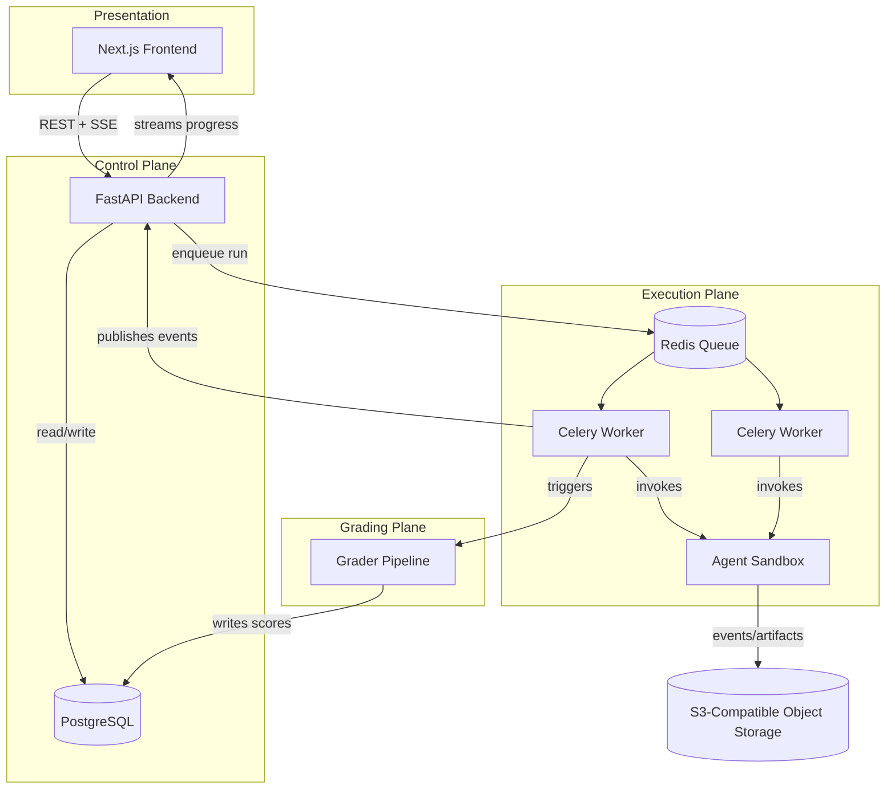
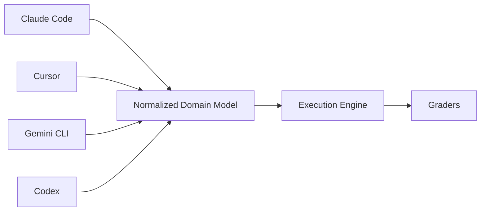
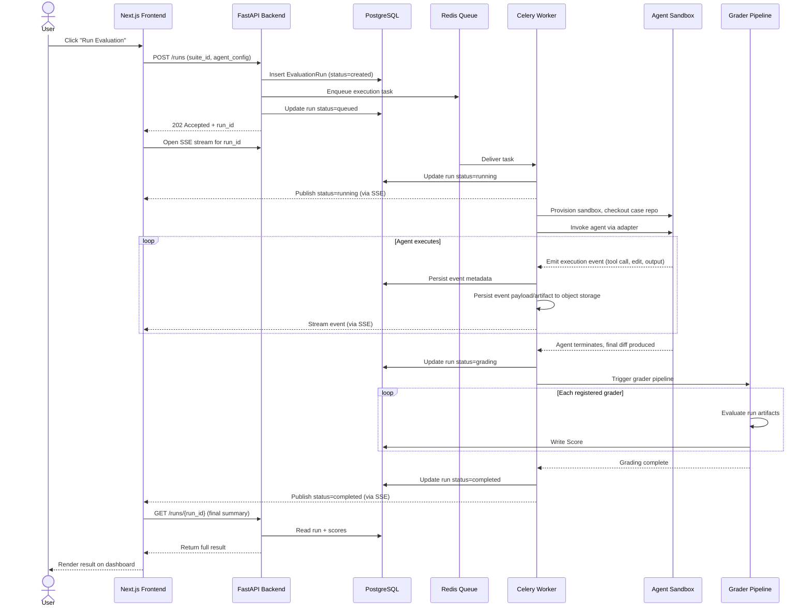
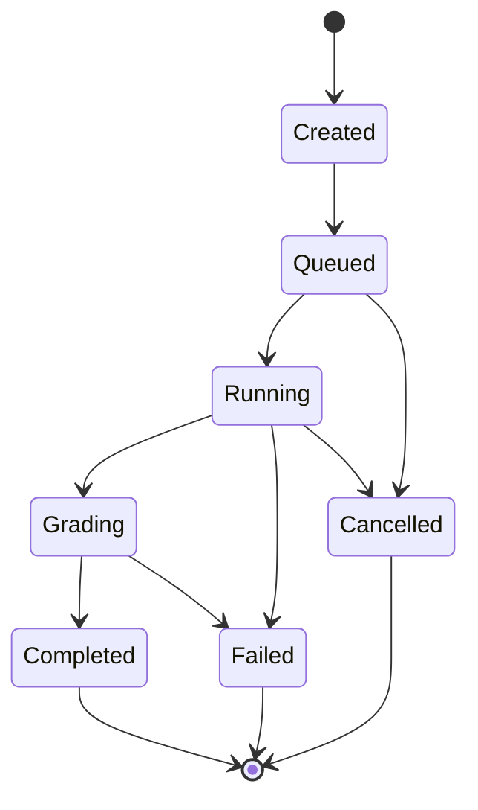

# EvalForge System Architecture

## 1. Purpose

Coding agents (Claude Code, Cursor, Codex, Gemini CLI, and the wave of agents that will follow) do not produce a single output to be scored for tone or factuality. They plan, call tools, edit multiple files, run test suites, iterate on failures, and terminate at some end state that either does or does not compile, pass tests, and solve the underlying issue. Evaluating that behavior requires infrastructure that treats git diffs, build systems, test runners, and multi-step tool-call traces as first-class citizens — not infrastructure built around scoring chat completions.

Existing eval tooling falls into two categories, neither of which fits:

1. **LLM-output evaluators** (Langfuse, PromptFoo, and similar) are built around single-turn or multi-turn *text* generation: a prompt goes in, a completion comes out, and graders judge that completion for relevance, toxicity, hallucination, or semantic similarity to a reference answer. They have no native concept of a sandboxed execution environment, a patch applied to a real repository, a test suite exit code, or a multi-step tool-call trajectory with intermediate failures and retries.
2. **CI/CD and test infrastructure** (GitHub Actions, Buildkite) execute code correctly but have no concept of an "agent," no way to compare agent versions or prompt versions against each other over time, and no grading abstraction beyond pass/fail.

EvalForge exists in the gap between these: it treats an agent run against a real engineering task as the unit of evaluation, captures everything the agent did along the way, grades the outcome using both objective signals (tests passed, build succeeded, diff applied cleanly) and structured rubric signals (code quality, adherence to constraints), and makes the resulting data queryable across agents, prompt versions, and time. The questions it needs to answer — *which agent regressed, which grader failed and why, what did this run cost, how has pass rate trended over the last ten prompt revisions* — are fundamentally longitudinal and comparative questions that neither category of existing tool is built to answer well.

## Guiding Constraints

The following constraints intentionally shape every architectural decision in EvalForge.

- Backend owns the product.
- Evaluation runs are immutable.
- Evaluation cases are generic and agent-agnostic.
- The execution engine never depends on a specific coding agent.
- Graders are independently deployable and independently executable.
- Every evaluation is reproducible through explicit versioning.
- Large execution artifacts are stored outside the relational database.
- APIs are the only supported integration boundary.

## 2. Terminology

The following definitions are canonical. All other documentation should defer to this table rather than redefining these terms locally.

| Term | Definition |
|---|---|
| **Project** | Top-level container scoping suites, cases, runs, and access control. The unit of authorization boundary. |
| **Evaluation Suite** | A named, versioned collection of evaluation cases executed together as a comparable unit. |
| **Evaluation Case** | A generic, extensible representation of a single engineering task (bug fix, feature request, refactor, security patch, etc.) that an agent attempts to solve. |
| **Evaluation Run** | A single, immutable execution of one agent against one evaluation case, producing an event stream and a set of scores. |
| **Execution Event** | A discrete, timestamped record of something that happened during a run — a tool call, file edit, shell command, or output. |
| **Artifact** | A large binary or text payload associated with a run (diff, log, full transcript) stored in object storage and referenced from Postgres by pointer, not stored inline. |
| **Grader** | An independently invokable unit that consumes a completed run's artifacts and produces one or more scores. |
| **Score** | A single graded output value — objective or rubric-based — attached to a run and produced by exactly one grader (and one grader version). |
| **Adapter** | The vendor-specific translation layer between a coding agent's native interface and EvalForge's normalized domain model. |
| **Execution Engine** | The component responsible for sandbox provisioning, repository checkout, and handing control to an adapter for a given run. |
| **Normalized Domain Model** | The internal, agent-agnostic representation of tool calls, edits, and outputs that the execution engine, event stream, and graders all operate on. |

## 3. Goals

### In Scope (V1)

- Define evaluation suites composed of evaluation cases, where a case is a generic, extensible representation of an engineering task (bug fix, feature request, refactor, security patch, etc.).
- Execute one or more coding agents against a case inside an isolated sandbox, using a uniform adapter interface regardless of the underlying agent's CLI or API surface.
- Capture the full execution trace of a run: tool calls, file edits, shell commands, stdout/stderr, and timing, as an append-only event stream.
- Grade completed runs using a modular grader pipeline that supports objective graders (test pass/fail, lint, build success, diff correctness) and rubric-based graders (LLM-as-judge scoring against a defined rubric).
- Persist immutable evaluation runs with full lineage back to the suite, case, agent version, and prompt version that produced them.
- Provide real-time progress visibility into an in-flight run via SSE.
- Provide a dashboard for comparing agents, prompt versions, and suites over time, including regression detection at the level of "this suite's pass rate dropped between run N and run N+1."
- Track per-run cost (tokens, execution time, compute) as a first-class metric alongside correctness metrics.

### Out of Scope (V1)

- Live monitoring of agents running in production against real user traffic. EvalForge evaluates against defined, versioned cases — it is not an APM tool for deployed agents.
- Agent authoring or orchestration. EvalForge invokes agents through adapters; it does not build or fine-tune them.
- A public marketplace of shared evaluation suites or graders.
- Multi-tenant billing and organization-level account management. V1 assumes a single organization operating the platform for its own use.

### Future Work

- A grader SDK that lets third parties (or other teams) implement and register custom graders without modifying core platform code.
- A public leaderboard API for cross-organization agent comparison.
- Baseline drift detection that flags a suite's pass rate or cost trend deviating from a rolling baseline without a human needing to eyeball a chart.
- Enterprise self-hosted deployment with private execution workers for organizations that cannot send code to a shared sandbox fleet.

## 4. Architecture Principles

These principles are load-bearing. Any design decision downstream in this document is traceable to one or more of them, and any future change that would violate one of them should be treated as an architecture-review-worthy event, not a routine implementation choice.

**Backend Owns the Product.** All product state and business logic live in the FastAPI backend; the frontend is a renderer, not a source of truth. This prevents the classic failure mode where business rules get duplicated (and drift) between client and server, and it guarantees that every capability is available to non-browser clients — CI integrations, CLIs, other internal tools — for free.

**API First.** The frontend consumes the same REST API any external caller would use; there is no private, undocumented internal API. This forces every feature to be designed as a stable contract before it's designed as a UI, which is what makes the API safe to build SDKs and integrations against later. REST, not GraphQL, is the deliberate choice here: EvalForge's domain is a small number of well-defined, resource-oriented entities (projects, suites, cases, runs, scores) with predictable access patterns, not a deeply nested graph with client-driven query shapes. REST gives simpler caching, simpler auth-per-endpoint, straightforward SDK generation, and lower operational complexity — none of which EvalForge would meaningfully benefit from trading for GraphQL's flexibility.

**Stable Internal Domain Model.** Every external coding agent is normalized into a single internal representation before it reaches the execution engine or any grader (see Section 7). This prevents vendor-specific branching logic from leaking into components that should be agent-agnostic, and it means the cost of supporting a new agent is bounded to writing one adapter.

**Loose Coupling.** Planes communicate through well-defined boundaries — REST, a queue, an event stream — rather than shared in-process state. This is what allows any one plane to be scaled, redeployed, or replaced without a coordinated release across the others.

**Immutable Evaluation Runs.** A run, once created, is append-only: events accumulate, status transitions forward, scores are added, but nothing about a completed run is ever mutated or deleted in place. This is what keeps trend charts and regression comparisons trustworthy — the moment historical runs can be edited, the platform's core value proposition (reliable longitudinal comparison) is compromised.

**Modular Graders.** Objective correctness (did tests pass) and subjective quality (is this a good diff) are different problems with different failure modes. Keeping graders as independently invokable, independently failing units means one grader's bug or timeout can never block the others, and a new grader can be added without touching existing ones.

**Adapter Pattern for Agents.** Claude Code, Cursor, Codex, and Gemini CLI each have different invocation surfaces, output formats, and tool-calling conventions. The adapter is the only layer permitted to know this. This prevents the execution engine and grading pipeline from accreting agent-specific special cases over time.

**Separation of Concerns.** The API never executes agent code; workers never serve HTTP; the frontend never writes to the database. This contains the blast radius of any bug or incident to a single plane and lets each plane be reasoned about, tested, and scaled independently.

**Event-Driven Execution.** Progress is modeled as a stream of discrete events, not a single terminal result, because an agent run is not atomic. This also makes the event log a first-class debugging artifact: "why did this evaluation fail" is answered by reading the event stream, not by trying to reproduce a possibly non-deterministic failure.

**Version Everything.** Every entity that can influence a run's outcome — suite, case, prompt, agent, adapter, and grader — is independently versioned, and every run pins the exact version of each at execution time (see Section 10). Without this, "the score changed" is unanswerable, because there is no way to know which of six moving parts actually moved.

**Explicit State Machines.** A run's lifecycle is a finite, explicit set of states with a validated set of allowed transitions (see Section 9), rather than an implicit status string that any component can set to any value. This eliminates an entire class of bugs where a run ends up in a state no code path was designed to handle.

**Storage Separation: Metadata vs. Artifacts.** Structured, queryable, relationally-integral data (run status, scores, lineage) lives in Postgres; large, write-once, rarely-relationally-queried payloads (transcripts, diffs, logs) live in object storage and are referenced by pointer. This keeps the database small, fast, and cheap to back up, while artifact storage scales independently and cheaply.

## 5. High-Level Architecture

EvalForge is split into four planes, each independently scalable:

- **Control plane** — the FastAPI backend and PostgreSQL. Owns all product state: projects, suites, cases, runs, scores. Every write to run state flows through here.
- **Execution plane** — Redis-backed Celery workers that pull queued run requests, invoke the appropriate agent adapter, and execute the agent inside a sandbox.
- **Grading plane** — a modular pipeline, invoked by workers after execution completes, that runs registered graders against the completed run's artifacts and emits scores.
- **Presentation plane** — the Next.js frontend, which is a pure consumer of the REST API and SSE stream. It holds no independent business logic.

Note that workers, not the API process, own the agent lifecycle. The API's only responsibilities in the execution path are validating the request, writing the initial run record, and enqueuing the task. This keeps the API stateless and horizontally scalable, and keeps long-running, resource-intensive agent execution entirely off the request/response path.

## 6. System Components

| Component | Responsibility | Why it exists |
|---|---|---|
| **Next.js Frontend** | Renders suites, runs, dashboards; subscribes to SSE for live run progress. | A dedicated frontend framework with SSR gives fast dashboard loads for what is fundamentally a data-heavy analytics product. |
| **FastAPI Backend** | Owns all product state via REST; validates requests; enqueues execution; exposes SSE endpoints. | Backend-owns-product means the frontend can never write directly to the database or queue — every state mutation is auditable and validated in one place. |
| **Redis Queue** | Broker for Celery; holds pending run tasks. | Decouples run submission from run execution. The API returns immediately after enqueuing; it never blocks on agent execution. |
| **Celery Workers** | Pull tasks, invoke adapters, manage sandbox lifecycle, publish execution events, trigger grading on completion. | Workers are the natural home for long-running, potentially minutes-long agent executions that should not tie up API request threads. |
| **Agent Adapters** | Translate a uniform "run this case" interface into the specific CLI/API calls each agent requires, and normalize the agent's output into the internal domain model. | New agents should be addable without touching the execution engine, the grading pipeline, or the database schema. |
| **Execution Engine** | Provisions the sandbox, checks out the case's repository state, hands control to the adapter, collects the resulting diff and normalized event stream. | Separating "how do we run an agent safely" from "how do we talk to this specific agent" keeps sandboxing logic single-sourced instead of duplicated per adapter. |
| **Graders** | Independent, composable units that consume a completed run's artifacts and emit one or more scores. | Objective correctness (did tests pass) and subjective quality (is this a good diff) are different problems with different failure modes; keeping them as separate pluggable units means one grader's bug or timeout doesn't block the others. |
| **PostgreSQL** | System of record for all structured entities: projects, suites, cases, runs, events (metadata), scores. | Relational integrity matters here — a score without a run, or a run without a case, is a data integrity bug, not an edge case to tolerate. |
| **Redis** | Task broker and, secondarily, a place for ephemeral run-progress state that backs the SSE stream. | Already required for Celery; reusing it for progress caching avoids introducing a second piece of infrastructure for the same durability tier. |
| **S3-Compatible Object Storage** | Stores large, immutable artifacts: full event transcripts, diffs, logs, sandbox stdout/stderr. | These artifacts are large, write-once, and rarely queried relationally — storing them in Postgres would bloat the database and slow down every backup and index rebuild. |
| **Authentication** | Identifies the calling user/service for every API request; scopes access to projects. | Even in V1's single-org deployment, evaluation history is sensitive (it reveals what agents are bad at) and must not be world-readable. |

| Responsibility | Owner |
|---------------|-------|
| Authentication | API |
| Authorization | API |
| Evaluation orchestration | Worker |
| Sandbox lifecycle | Execution Engine |
| Agent communication | Adapter |
| Score generation | Graders |
| Artifact persistence | Object Storage |
| Metadata persistence | PostgreSQL |
| Live updates | API (SSE) |
| Rendering | Frontend |

## 7. Normalized Internal Domain Model

Section 6 describes what the adapter and execution engine each do. This section describes the contract between them, which is what actually makes the Adapter Pattern principle deliver on its promise of decoupling.

Every coding agent EvalForge supports is translated into a single, stable internal representation before it enters the execution engine. Nothing downstream of the adapter — the execution engine, the event schema, the graders, the dashboard — ever branches on which agent produced a run.

Each adapter is responsible for mapping its agent's native tool-call format, edit representation, and output structure onto this shared model. A tool call is a tool call, a file edit is a file edit, and a terminal command is a terminal command, regardless of whether the agent expressed it as a JSON tool-use block, an XML-tagged action, or a CLI subprocess invocation.

This normalization is the actual mechanism — not just the stated intent — behind vendor-agnostic evaluation:

- **The execution engine is written once.** It provisions sandboxes, checks out repositories, and streams events without needing to understand any agent-specific protocol.
- **Graders are written once.** A test-pass grader or a diff-quality grader operates on normalized edits and outputs; it does not need a Cursor-specific code path and a Codex-specific code path.
- **Adding a new agent is adapter-only work.** Supporting a fifth or sixth coding agent means writing a new adapter against the existing normalized schema — it does not touch the execution engine, the event schema, or any existing grader.
- **Vendor CLI/output changes are contained.** When an agent vendor changes their CLI's output format (which happens frequently, and without notice, in this space), exactly one adapter needs to change. Every other component is unaffected because it never depended on the vendor's format in the first place.

## 8. Evaluation Execution Lifecycle

The canonical flow — a user clicking "Run Evaluation" through to a result appearing on the dashboard — touches every plane described above.

Two properties of this flow are deliberate. First, the run record is written and returned to the client *before* execution starts — the user never waits on a synchronous HTTP call for something that might take minutes. Second, every event and score write goes through the worker into Postgres/object storage, never directly from the sandbox — the sandbox is untrusted execution and should never hold credentials to write to the system of record.

## 9. Run State Machine

A run's status is not a free-form string that any component can set to any value — it is a finite set of states with an explicit, validated set of allowed transitions. This is what the Explicit State Machines principle means in practice: a worker cannot move a run from `Queued` directly to `Completed`, and nothing can move a run out of a terminal state once it's reached.

- **Created** — the run record exists and has been validated, but has not yet been handed to the queue.
- **Queued** — a task has been enqueued and is waiting for a worker to pick it up.
- **Running** — a worker has claimed the task and the agent is executing inside a sandbox.
- **Grading** — agent execution has terminated (successfully or not) and the grader pipeline is evaluating the resulting artifacts.
- **Completed / Failed / Cancelled** — terminal states. No further transitions are valid once reached, which is what makes a run's history trustworthy for trend analysis.

Partial grading (some but not all expected graders producing a score) is represented as metadata on a `Completed` run rather than as a separate top-level state — the run did complete its lifecycle; which graders succeeded is a property of that completion, not a different lifecycle outcome. This keeps the state machine small and enumerable rather than combinatorially exploding with every new grading edge case.

## 10. Versioning Philosophy

A run is only meaningful if every entity that could have influenced its outcome is pinned to a specific, immutable version at execution time. Six independent axes can each change the result of a run; the platform tracks all six separately rather than assuming any of them are stable.

| Entity | What triggers a new version | Why it must be versioned |
|---|---|---|
| **Evaluation Suite** | Adding, removing, or reordering cases within the suite | A suite version is the frozen configuration a run was executed against; comparing runs across suite versions without pinning silently compares different workloads. |
| **Evaluation Case** | Any change to the task description, reference repository state, or expected checks | Runs bind to a specific case version, not to a mutable "the case," so historical results stay interpretable after a case is later edited. |
| **Prompt** | Any change to the instructions/system prompt given to the agent | Prompt regressions are only measurable by holding case and agent version constant while varying prompt version. |
| **Agent** | Any change in the underlying agent's release or build (e.g., a new CLI version) | Agent behavior shifts across vendor releases independent of anything EvalForge controls; the version must be captured at run time, not assumed. |
| **Adapter** | Any change to how agent output is mapped onto the normalized domain model | Adapter changes can alter measured behavior even when the underlying agent hasn't changed, and must be distinguishable from agent-caused changes. |
| **Grader** | Any change to rubric wording, scoring thresholds, or objective check logic | Scores from different grader versions are not comparable; without versioning, an apparent regression could be a rubric change rather than an agent change. |

The platform version itself (execution engine behavior, event schema, grading pipeline) is also recorded per run, isolating platform-caused behavior changes from changes in the entity actually under test.

Immutable versioning across these axes is what makes reproducibility possible: a run is fully specified only when suite, case, prompt, agent, adapter, and grader versions are all pinned. It's also what makes regression analysis tractable — when a score changes between two runs, versioning provides a finite, enumerable set of variables that could have caused it, rather than an open-ended "something changed."

## 11. Failure Model

EvalForge runs untrusted, long-lived, multi-step processes across multiple infrastructure boundaries; failure is a normal operating condition to design for, not an exception path.

| Failure scenario | Architectural intent |
|---|---|
| Worker crashes mid-run | Lease/ownership semantics ensure a crashed worker cannot leave a run silently stuck in `Running`; the run is requeued or explicitly marked `Failed`. |
| Sandbox provisioning or runtime failure | Treated as an infrastructure failure distinct from an agent failing the case — never conflated with a legitimate "agent did not solve the task" outcome. |
| Agent timeout | Every run has a bounded execution window; timeout is a defined terminal outcome, not an indefinite hang. |
| Queue (Redis) unavailable at submission | The API fails closed on enqueue rather than accepting a run request it cannot fulfill and silently losing it. |
| Redis outage during execution | Affects only run submission and live SSE progress; already-persisted run and event data in Postgres is unaffected, because Redis is deliberately excluded from the durable path. |
| Object storage write failure | Distinguished from a metadata write failure — a run with persisted event metadata but a failed artifact upload is marked with an explicit partial-artifact state. |
| Individual grader failure | Isolated to that grader; other graders in the pipeline complete independently. |
| Partial grading | Surfaced explicitly — a run with 3 of 5 expected scores is never presented as equivalent to a fully graded run. |

**Retry strategy.** Transient infrastructure failures (worker crash, sandbox provisioning failure) are retried with bounded attempts and backoff, because retrying them doesn't change what's being measured. Agent-level failures (the agent produced a bad diff, or failed the case) are never retried automatically — automatically re-running until an agent succeeds would corrupt the very thing the platform exists to measure.

**Idempotent execution.** Task delivery is not guaranteed to happen exactly once (a broker redelivery after a slow acknowledgment is a normal occurrence). Execution and grading are designed so that reprocessing the same task delivery converges to the same persisted state rather than producing duplicate events, duplicate scores, or duplicate cost.

## 12. Observability

EvalForge is infrastructure other teams rely on to make agent-adoption and regression decisions. If the platform itself is a black box when something goes wrong, it undermines trust in the very data it produces — observability here is a product requirement, not an operational nicety.

- **Structured logging.** Every log line is emitted as structured data with consistent fields, so logs are queryable rather than grepped.
- **Correlation IDs.** A single correlation ID threads through the full path of a run — from API acceptance through worker processing and grading — so the entire lifecycle of a run can be reconstructed across process boundaries.
- **Run IDs.** The primary key for anything execution- or grading-related. All events, artifacts, scores, and logs reference the run ID that produced them.
- **Worker IDs.** Every event and log records which worker instance produced it, which is essential for distinguishing worker-specific failures (bad host, resource exhaustion) from systemic ones.
- **Metrics.** The platform emits metrics for queue depth, worker utilization, run throughput, run duration percentiles, grader latency, and per-run cost — the numbers that answer "is the platform itself healthy," independent of any individual evaluation result.
- **Health endpoints.** The API and workers expose liveness/readiness endpoints so orchestration can make correct scheduling decisions without inferring health from application-level behavior.
- **Audit logs.** Distinct from execution events — audit logs capture who triggered which administrative action (created a suite, triggered a run, modified a case) and are retained independently of run data lifecycle policies.
- **Distributed tracing (future).** Full request/run tracing across API, worker, and sandbox is future work, warranted once the platform's process topology grows enough that correlation IDs in logs stop being sufficient for root-causing latency.

## 13. Performance Goals

These are design goals, not implementation commitments — they exist to keep architectural decisions honest about what "fast enough" means for each plane.

- **API responsiveness.** Control-plane endpoints (create run, list suites, fetch dashboard data) should respond in the low hundreds of milliseconds. Nothing in the API request path should ever block on agent execution.
- **Worker throughput.** The platform should sustain many concurrent runs, bounded by available worker/sandbox capacity — not by contention in the queue or control plane.
- **Queue latency.** Time between a run being enqueued and a worker picking it up should stay small relative to run execution time (which is itself minutes). Queue latency is pure overhead the user perceives as "nothing is happening yet."
- **Dashboard responsiveness.** Trend and comparison views over historical runs should remain fast as run history grows into the tens or hundreds of thousands of runs — this is the primary justification for the partitioning and read-replica strategy described in Section 14.
- **Artifact storage strategy.** Large artifacts are never inlined in an API response; the API returns references to object storage, and clients fetch large payloads directly, keeping response sizes bounded regardless of how large a given run's transcript is.

## 14. Scalability Strategy

The architecture scales along the two axes that actually matter for this workload: **run throughput** (how many agent executions can happen concurrently) and **query volume** (how much dashboard/analytics traffic the API can serve).

- **API layer** is stateless by construction — no in-process session state, no sticky routing requirements — so it scales horizontally behind a load balancer with no coordination overhead. This is the layer least likely to need scaling first, since its work (CRUD against Postgres, enqueuing tasks) is cheap relative to agent execution.
- **Worker layer** is the primary scaling lever. Because each run's execution is independent and stateless from the worker's perspective (all state lives in Postgres/object storage, not in worker memory), workers scale by adding processes/instances with no data migration or rebalancing. Queues can be split by resource class (e.g., a lightweight queue for cases with small repos, a heavier queue for cases that need larger sandboxes) so that resource-hungry runs don't starve fast ones — this is a deliberate choice to make in V1's queue design even though a single queue would work initially, since retrofitting queue segmentation later requires a migration.
- **Queue (Redis)** scales via a managed clustered instance once single-node throughput becomes a bottleneck. Given Celery's task volume in this workload (one task per run, not one task per event), this is unlikely to be an early bottleneck — event ingestion goes through the worker's existing Postgres/S3 writes, not through additional queue traffic.
- **PostgreSQL** is the component most likely to need active management as run volume grows, specifically the `execution_events` table, which grows unboundedly and is written far more often than it's read in full. Time-based partitioning of that table (not sharding — partitioning) is the first lever, followed by read replicas for dashboard/analytics queries once those queries start competing with write traffic from active runs.
- **Object storage** scales without platform-level intervention — this is precisely why large artifacts (full event payloads, logs, diffs) live there instead of in Postgres.

What we are explicitly *not* doing in V1: multi-region deployment, database sharding, or a dedicated analytics warehouse separate from Postgres. Each of these solves a problem this platform doesn't have yet at expected V1 run volumes, and each adds real operational cost. The architecture is built so that none of them are precluded later — partitioned, append-only tables migrate cleanly to a warehouse; a stateless worker fleet migrates cleanly to multi-region — but building them now would be optimizing against a load profile we don't have data on yet.

## 15. Security Considerations

### Security Controls

**Authentication.** Every API request is authenticated; there is no anonymous access to run data, even read-only. Session/token validation happens once, at the API boundary — workers and the grading pipeline trust the API's writes rather than re-authenticating internally.

**Authorization.** Access is scoped at the project level. A user's ability to view or trigger runs is bound to the projects they belong to; this scoping is enforced in the API layer on every query, not left to the frontend to hide-and-hope.

**Secrets.** Agent credentials (API keys for the coding agents under test) are stored encrypted at rest and are injected into the sandbox at execution time only — they are never written into the event log, never persisted to object storage, and never returned in any API response. This matters specifically because event transcripts are otherwise stored verbatim for debuggability; secret redaction has to be enforced structurally, not left to grader or logging discipline.

**Isolation.** Each run executes in its own sandbox, provisioned fresh and torn down after execution, with restricted network egress (the agent should reach only what the case explicitly requires, not the open internet). This is the load-bearing security boundary of the whole system: EvalForge is, definitionally, running untrusted, autonomously-generated code and shell commands on every single run.

**Auditability.** Because runs are immutable and append-only, the audit trail is a natural byproduct of the data model rather than a bolted-on logging system. Every run carries who triggered it, when, against which suite/case/agent version, and every scoring decision is traceable to the specific grader and grader version that produced it.

### Threat Model

- **Untrusted repositories.** A case's target repository may itself contain adversarial content — malicious build scripts, adversarial test files. The sandbox boundary must hold even if the repository under test is hostile, not just if the agent's actions are unpredictable.
- **Arbitrary shell execution.** Coding agents run arbitrary shell commands by design. This is treated as an assumed capability of every run, not an edge case — every sandbox is provisioned as if it will execute untrusted code, because it will.
- **Sandbox escape.** The sandbox is the single most security-critical boundary in the system; its isolation guarantees (process, filesystem, network) are the control that every other component's trust assumptions depend on.
- **Secret leakage.** Addressed structurally, as described under Secrets above — a compromised sandbox should have no path to any credential beyond the ones explicitly provisioned for that specific run.
- **Supply-chain attacks.** Packages or tools an agent installs during a run are also untrusted. Sandbox network egress restrictions limit what an agent-installed dependency can reach, bounding the blast radius of a compromised transitive dependency.
- **Dependency isolation.** Each run's sandbox has no persistent state or shared filesystem with other runs or with the host — a compromised or malicious dependency installed in one run cannot affect another run or the platform itself.
- **Network isolation.** Sandbox network egress is restricted to what a case explicitly requires (e.g., specific package registries). Default-deny egress is the posture, not default-allow with exceptions.

## 16. Non-Goals

- **Production agent monitoring.** EvalForge is not an APM/observability tool for agents running against real user traffic; it evaluates against defined, versioned cases in a controlled environment.
- **Autonomous remediation.** EvalForge grades and reports; it does not attempt to fix failing runs, retry with modified prompts automatically, or take any corrective action beyond surfacing the failure.
- **General-purpose LLM chat evaluation.** EvalForge is not a replacement for tools evaluating conversational quality, RAG accuracy, or non-coding LLM outputs. Its schema and grading model are specific to engineering tasks with objectively checkable outcomes.
- **Code review or PR management.** EvalForge produces diffs and scores; it does not manage the lifecycle of getting a diff merged, reviewed, or deployed.
- **Agent training or fine-tuning feedback loops.** EvalForge's output is data an agent team could use for training, but closing that loop automatically is out of scope for the platform itself.

## 17. Future Evolution

The architecture is deliberately structured so that the most likely V2/V3 requirements are additive rather than migratory:

- **A grader SDK** formalizes the already-modular grader interface into a versioned, documented contract, allowing graders to be registered without modifying core platform code — the internal architecture doesn't change, only the registration mechanism gains a stable public surface.
- **Multi-tenant support** (organizations, billing, SSO) sits cleanly on top of the existing project-scoped authorization model; project scoping was chosen specifically so that adding an organization layer above it is a schema addition, not a redesign.
- **A public agent leaderboard** consumes the same immutable run/score data already being persisted — it's a new read-path (and an anonymization/aggregation layer) on existing data, not a new write-path.
- **Baseline drift detection** is a query over the existing time-partitioned run/score history; no new data needs to be captured to support it, only new analysis on top of what's already collected.
- **Enterprise self-hosted execution workers** are possible because the execution plane already communicates with the control plane over the queue and REST boundaries rather than shared process state — a customer's workers can point at their own sandbox fleet while the control plane stays centrally hosted, or the entire stack can be deployed on-prem using the same component boundaries.

The common thread is that every anticipated evolution extends a plane rather than collapsing the boundaries between them. That is the actual test the architecture was designed against: not "can we build this fast," but "when this needs to grow, does it grow by adding a component, or by rewriting one." For every item above, the answer is the former.

## Key Architectural Decisions

| Decision | Status |
|-----------|--------|
| REST over GraphQL | Accepted |
| PostgreSQL as system of record | Accepted |
| Object Storage for artifacts | Accepted |
| Adapter Pattern | Accepted |
| Modular Graders | Accepted |
| Immutable Runs | Accepted |
| Event-driven execution | Accepted |
| Backend-first architecture | Accepted |

## Related Documents

- Backend Architecture
- Domain Model
- API Guidelines
- ADR-0001 System Architecture
- ADR-0002 Adapter Pattern
- ADR-0003 Modular Graders